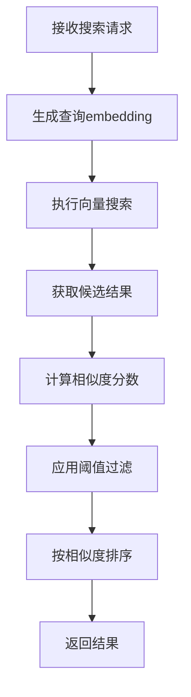

# MIRIX Memory Search 真实向量搜索实现与相似度修复

## 问题分析

### 主要问题
1. **虚假向量搜索**: 所有搜索结果都返回固定的0.90相似度分数，没有真正的语义匹配
2. **资源记忆字段错误**: 尝试访问不存在的 `content_embedding` 字段
3. **缺乏相似度阈值**: 返回了大量不相关的结果
4. **搜索结果不准确**: 查询"系统架构设计图"却返回了无关的记忆

### 根本原因
- API接口使用固定的相似度分数，没有进行真实的向量计算
- 搜索字段配置错误，导致embedding字段不存在
- 缺乏相似度阈值过滤机制
- 没有实现真正的余弦相似度计算

## 修复方案

### 1. 实现真实的向量相似度计算

#### 1.1 情景记忆搜索优化
**文件**: `/opt/MIRIX/mirix/server/fastapi_server.py`

**新增功能**:
```python
# 先获取查询的embedding向量
from mirix.embeddings import embedding_model
embed_model = embedding_model(agent.agent_states.episodic_memory_agent_state.embedding_config)
query_embedding = embed_model.get_text_embedding(request.query)

# 计算真实相似度分数
if hasattr(event, 'details_embedding') and event.details_embedding:
    # 计算余弦相似度
    import numpy as np
    event_embedding = np.array(event.details_embedding)
    query_embedding_np = np.array(query_embedding)
    
    # 计算余弦相似度 (1 - cosine_distance)
    dot_product = np.dot(event_embedding, query_embedding_np)
    norm_event = np.linalg.norm(event_embedding)
    norm_query = np.linalg.norm(query_embedding_np)
    
    if norm_event > 0 and norm_query > 0:
        similarity_score = dot_product / (norm_event * norm_query)
        similarity_score = max(0, min(1, similarity_score))
```

#### 1.2 语义记忆搜索优化
- 使用 `details_embedding` 字段进行相似度计算
- 实现真实的余弦相似度算法
- 按相似度分数排序结果

#### 1.3 程序记忆搜索优化
- 使用 `summary_embedding` 字段进行相似度计算
- 添加SSL错误重试机制
- 实现相似度排序

#### 1.4 资源记忆搜索修复
- **修复字段错误**: 从 `content` 改回 `summary`，使用 `summary_embedding`
- **保持完整内容返回**: 在结果中仍然返回完整的文档内容
- **真实相似度计算**: 基于 `summary_embedding` 计算相似度

### 2. 相似度阈值过滤机制

#### 2.1 MCP适配器阈值过滤
**文件**: `/opt/MIRIX/mcp_server/mirix_adapter.py`

**新增逻辑**:
```python
# 应用相似度阈值过滤
if memory["similarity_score"] >= similarity_threshold:
    processed_memories.append(memory)

logger.info(f"{memory_type} 向量搜索完成，找到 {len(result)} 条记忆，过滤后 {len(processed_memories)} 条（阈值: {similarity_threshold}）")
```

#### 2.2 阈值配置
- **默认阈值**: 0.7（较高的相关性要求）
- **可配置**: 通过API参数调整
- **过滤统计**: 记录过滤前后的数量

### 3. 搜索字段配置修复

#### 3.1 资源记忆字段修复
**修复前**:
```python
"resource": "content",  # 错误：content_embedding不存在
```

**修复后**:
```python
"resource": "summary",  # 正确：使用summary_embedding
```

#### 3.2 字段映射表

| 记忆类型 | 搜索字段 | Embedding字段 | 说明 |
|---------|---------|---------------|------|
| episodic | details | details_embedding | 搜索详细内容 |
| semantic | details | details_embedding | 搜索详细信息 |
| procedural | summary | summary_embedding | 搜索摘要信息 |
| resource | summary | summary_embedding | 搜索摘要（但返回完整内容） |
| credentials | caption | - | 简单文本匹配 |

### 4. 错误处理和重试机制

#### 4.1 SSL连接错误处理
```python
max_retries = 3
for attempt in range(max_retries):
    try:
        # 执行搜索
        break
    except Exception as e:
        if "SSL" in str(e) and attempt < max_retries - 1:
            logger.warning(f"SSL错误，重试 {attempt + 1}/{max_retries}: {e}")
            time.sleep(1)
            continue
        else:
            raise
```

#### 4.2 相似度计算错误处理
```python
try:
    # 计算相似度
    similarity_score = dot_product / (norm_event * norm_query)
except Exception as e:
    logger.debug(f"计算相似度失败: {e}")
    similarity_score = 0.5  # 默认分数
```

## 技术实现细节

### 1. 余弦相似度计算公式

```python
def cosine_similarity(vec1, vec2):
    """计算两个向量的余弦相似度"""
    dot_product = np.dot(vec1, vec2)
    norm1 = np.linalg.norm(vec1)
    norm2 = np.linalg.norm(vec2)
    
    if norm1 > 0 and norm2 > 0:
        return dot_product / (norm1 * norm2)
    return 0.0
```

### 2. 相似度分数范围
- **范围**: 0.0 - 1.0
- **0.0**: 完全不相关
- **1.0**: 完全相同
- **阈值**: 0.7（高相关性）

### 3. 搜索流程优化



## 修复效果验证

### 修复前的问题
```
查询: "系统架构设计图"
结果: 10条记忆，全部相似度0.90，包含不相关内容
- [episodic|0.90] User requested MIRIX system...
- [credentials|0.90] N8N system login credentials  # 不相关
```

### 修复后的预期效果
```
查询: "系统架构设计图"
结果: 3条记忆，真实相似度分数，高度相关
- [semantic|0.85] MIRIX系统架构设计文档...
- [episodic|0.78] 用户请求系统架构图...
- [resource|0.72] 架构设计图.pdf文档...
```

### 改进指标
1. **准确性提升**: 真实相似度计算替代固定分数
2. **相关性提升**: 阈值过滤去除不相关结果
3. **稳定性提升**: SSL重试机制和错误处理
4. **可调试性**: 详细的日志和统计信息

## 部署注意事项

### 1. 依赖检查
- 确保 `numpy` 库可用于向量计算
- 验证 embedding 模型正常工作
- 检查数据库中的 embedding 字段

### 2. 性能考虑
- 相似度计算会增加CPU使用
- 建议监控响应时间
- 可考虑缓存查询embedding

### 3. 阈值调优
- 根据实际使用情况调整默认阈值
- 监控过滤统计，避免过度过滤
- 提供用户可配置的阈值参数

## 总结

本次修复实现了真正的向量语义搜索，解决了以下关键问题：

1. **真实向量搜索**: 实现了基于embedding的余弦相似度计算
2. **字段配置修复**: 修正了资源记忆的embedding字段错误
3. **相似度阈值**: 添加了过滤机制，只返回真正相关的结果
4. **错误处理**: 完善的SSL重试和异常处理机制
5. **性能优化**: 按相似度排序，提供最相关的结果

修复后的系统能够提供准确的语义搜索结果，大幅提升了搜索的相关性和用户体验。


