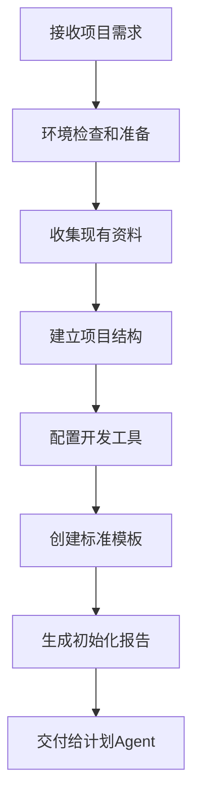
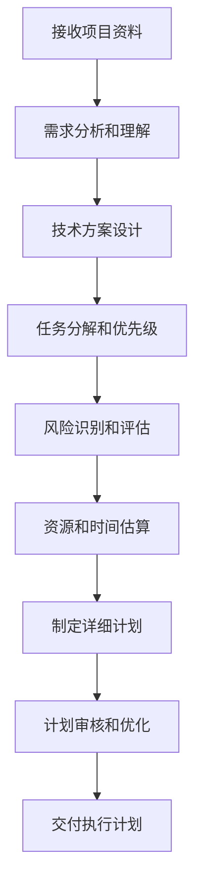
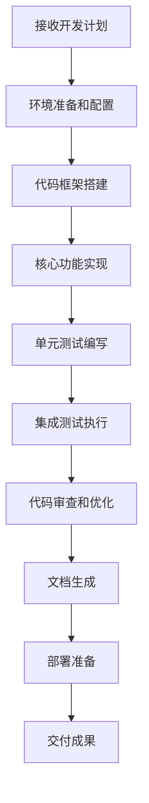
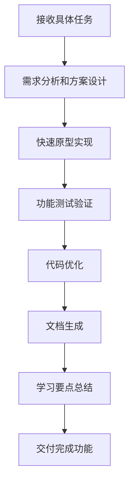
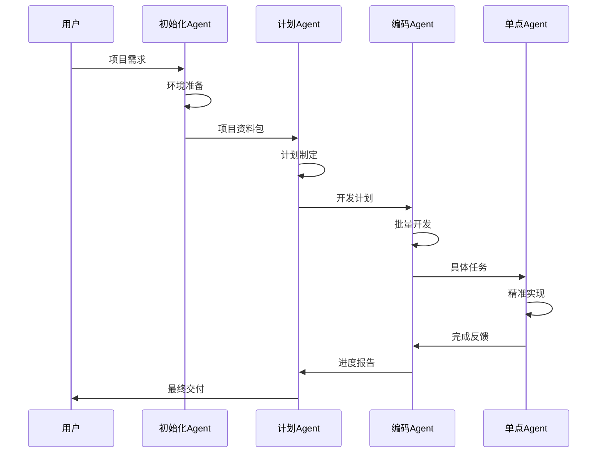

# 智能体工作流程深度分析

## 概述
本文档深度分析四个智能体的作用、流程控制机制，以及它们如何协同解决9个核心编码问题。

## 智能体架构设计

### 整体架构图
```
┌─────────────────────────────────────────────────────────────┐
│                    智能体协作系统                              │
├─────────────────────────────────────────────────────────────┤
│  项目初始化Agent → 开发计划Agent → 编码执行Agent → 单点任务Agent │
│       ↓              ↓              ↓              ↓        │
│   环境准备        计划制定        批量开发        精准实现      │
│   资料整理        任务分解        质量控制        快速迭代      │
│   标准建立        风险评估        进度跟踪        问题解决      │
└─────────────────────────────────────────────────────────────┘
```

## 各Agent深度分析

### 1. 项目初始化Agent

#### 核心作用
- **环境标准化**: 建立统一的开发环境和编码标准
- **资料整理**: 收集和组织项目相关文档和资源
- **基础设施**: 搭建项目基础架构和工具链
- **问题预防**: 通过标准化预防常见问题

#### 流程控制机制


#### 解决的核心问题

**问题1: 日志打印不详细**
- **解决方案**: 建立统一的日志记录标准和模板
- **实现机制**: 
  ```python
  # 日志配置模板
  LOGGING_CONFIG = {
      'version': 1,
      'formatters': {
          'detailed': {
              'format': '[%(asctime)s] %(levelname)s [%(name)s:%(lineno)d] %(message)s'
          }
      },
      'handlers': {
          'file': {
              'class': 'logging.FileHandler',
              'filename': 'debug.log',
              'formatter': 'detailed'
          }
      }
  }
  ```

**问题2: 数据隔离不足**
- **解决方案**: 建立数据隔离的项目结构和配置
- **实现机制**: 创建独立的配置文件、数据目录、测试环境

**问题7: Linux环境优势**
- **解决方案**: 优先配置Linux开发环境，提供Windows兼容方案
- **实现机制**: 环境检测脚本，自动选择最佳配置

**问题9: 重复操作封装**
- **解决方案**: 创建常用操作的脚本库和工具集
- **实现机制**: 
  ```bash
  # 项目初始化脚本库
  scripts/
  ├── init_project.sh      # 项目结构初始化
  ├── setup_database.sh    # 数据库初始化
  ├── generate_api.sh      # API代码生成
  └── deploy_docker.sh     # Docker部署
  ```

#### 质量控制点
1. **环境一致性检查**: 确保所有开发者使用相同的环境配置
2. **标准合规性验证**: 验证项目结构符合既定标准
3. **工具链完整性**: 确保所有必要工具正确安装和配置
4. **文档完整性**: 验证项目文档的完整性和准确性

### 2. 开发计划制定Agent

#### 核心作用
- **需求分析**: 深度理解项目需求和技术约束
- **任务分解**: 将复杂项目分解为可管理的任务
- **风险评估**: 识别潜在风险和制定应对策略
- **资源规划**: 合理分配开发资源和时间

#### 流程控制机制


#### 解决的核心问题

**问题3: 冲突问题处理**
- **解决方案**: 建立冲突检测和解决机制
- **实现机制**:
  ```markdown
  ## 冲突处理流程
  1. **冲突检测阶段**
     - 代码与文档一致性检查
     - 数据库字段与API接口对比
     - 配置文件冲突扫描
  
  2. **冲突解决策略**
     - 确定权威数据源（优先级：设计文档 > 数据库 > 代码）
     - 批量修正非权威源
     - 建立变更追踪机制
  
  3. **预防措施**
     - 定期一致性检查
     - 变更影响分析
     - 自动化同步工具
  ```

**问题8: 先计划后开发**
- **解决方案**: 强制性的计划制定和审核流程
- **实现机制**:
  ```markdown
  ## 开发计划模板
  
  ### 简单任务计划（<2天）
  1. [ ] 需求确认和方案设计
  2. [ ] 实现方案评审
  3. [ ] 代码实现
  4. [ ] 测试验证
  5. [ ] 代码审核
  
  ### 复杂任务计划（>2天）
  1. [ ] 详细需求分析
  2. [ ] 技术方案设计
  3. [ ] 方案评审和优化
  4. [ ] 任务分解和排期
  5. [ ] 阶段性实现
  6. [ ] 每阶段人工审核
  7. [ ] 集成测试
  8. [ ] 最终验收
  ```

**问题5: 测试方案差异化**
- **解决方案**: 根据项目特点制定差异化测试策略
- **实现机制**:
  ```markdown
  ## 测试策略矩阵
  
  | 项目类型 | 环境要求 | 测试方案 | 工具选择 |
  |---------|---------|---------|---------|
  | Docker应用 | 容器环境 | 镜像重建测试 | Docker Compose |
  | REST API | 开发环境 | IDE内置测试 | IntelliJ HTTP Client |
  | 数据库应用 | 隔离环境 | 事务回滚测试 | TestContainers |
  | 前端应用 | 浏览器环境 | 自动化UI测试 | Cypress/Playwright |
  ```

#### 质量控制点
1. **需求理解准确性**: 确保对需求的理解无偏差
2. **任务分解合理性**: 验证任务粒度和依赖关系
3. **风险评估完整性**: 确保识别所有潜在风险
4. **计划可执行性**: 验证计划的实际可操作性

### 3. 编码执行Agent

#### 核心作用
- **批量开发**: 执行大规模的代码开发任务
- **质量控制**: 确保代码质量和一致性
- **进度管理**: 跟踪开发进度和里程碑
- **问题解决**: 处理开发过程中的技术问题

#### 流程控制机制


#### 解决的核心问题

**问题1: 详细日志打印**
- **解决方案**: 在所有代码中集成详细的日志记录
- **实现机制**:
  ```python
  # 统一日志记录装饰器
  def detailed_logging(func):
      @wraps(func)
      def wrapper(*args, **kwargs):
          logger.info(f"开始执行 {func.__name__}, 参数: args={args}, kwargs={kwargs}")
          try:
              result = func(*args, **kwargs)
              logger.info(f"执行成功 {func.__name__}, 结果: {result}")
              return result
          except Exception as e:
              logger.error(f"执行失败 {func.__name__}, 错误: {str(e)}", exc_info=True)
              raise
      return wrapper
  ```

**问题4: 解释型和学习型开发**
- **解决方案**: 生成详细的代码注释和学习文档
- **实现机制**:
  ```python
  # 自动生成学习文档
  def generate_learning_doc(module_path):
      """
      为代码模块生成学习文档
      
      包含：
      1. 功能概述和使用场景
      2. 核心算法和设计模式
      3. 关键代码段解释
      4. 最佳实践总结
      5. 常见问题和解决方案
      """
      pass
  ```

**问题6: 知识缺乏处理**
- **解决方案**: 集成知识查询和学习机制
- **实现机制**:
  ```python
  # 知识查询接口
  class KnowledgeAgent:
      def query_best_practice(self, technology, scenario):
          """查询特定技术在特定场景下的最佳实践"""
          pass
      
      def get_code_examples(self, pattern, language):
          """获取设计模式的代码示例"""
          pass
      
      def explain_concept(self, concept):
          """解释技术概念"""
          pass
  ```

#### 质量控制点
1. **代码质量标准**: 静态代码分析、代码覆盖率检查
2. **功能完整性**: 确保所有计划功能都已实现
3. **性能基准**: 验证代码性能满足要求
4. **安全性检查**: 安全漏洞扫描和修复

### 4. 单点编码任务Agent

#### 核心作用
- **精准实现**: 快速准确地实现单个功能点
- **问题诊断**: 快速定位和解决具体问题
- **快速迭代**: 支持敏捷开发的快速迭代
- **学习输出**: 提供学习型的代码和文档

#### 流程控制机制


#### 解决的核心问题

**问题1: NextCloud和MaxKey跳转问题**
- **解决方案**: 提供详细的问题诊断和解决流程
- **实现机制**:
  ```python
  # 跳转问题诊断工具
  class RedirectDiagnostic:
      def diagnose_redirect_issue(self, source_url, target_url):
          """
          诊断跳转问题的详细流程：
          1. 检查HTTP响应头
          2. 验证Cookie设置
          3. 分析JavaScript跳转
          4. 检查CORS配置
          5. 验证认证流程
          """
          logger.info(f"开始诊断跳转问题: {source_url} -> {target_url}")
          
          # 详细的诊断步骤...
          
          return diagnostic_report
  ```

**问题2: 设计偏差和数据污染**
- **解决方案**: 实现数据隔离和上下文清理机制
- **实现机制**:
  ```python
  # 上下文隔离管理器
  class ContextIsolation:
      def __init__(self):
          self.contexts = {}
      
      def create_isolated_context(self, context_id):
          """创建隔离的上下文环境"""
          self.contexts[context_id] = {
              'memory': {},
              'config': {},
              'state': {}
          }
          logger.info(f"创建隔离上下文: {context_id}")
      
      def cleanup_context(self, context_id):
          """清理上下文，避免数据污染"""
          if context_id in self.contexts:
              del self.contexts[context_id]
              logger.info(f"清理上下文: {context_id}")
  ```

**问题5: 差异化测试**
- **解决方案**: 智能选择最适合的测试方案
- **实现机制**:
  ```python
  # 智能测试策略选择器
  class TestStrategySelector:
      def select_test_strategy(self, project_type, environment):
          """
          根据项目类型和环境选择最佳测试策略
          """
          strategies = {
              'docker_app': self.docker_test_strategy,
              'rest_api': self.api_test_strategy,
              'web_app': self.web_test_strategy,
              'cli_tool': self.cli_test_strategy
          }
          
          return strategies.get(project_type, self.default_test_strategy)
      
      def docker_test_strategy(self):
          """Docker应用测试策略：重建镜像测试"""
          return {
              'method': 'container_rebuild',
              'tools': ['docker-compose', 'testcontainers'],
              'steps': [
                  '构建新镜像',
                  '启动测试容器',
                  '执行集成测试',
                  '清理测试环境'
              ]
          }
  ```

#### 质量控制点
1. **功能正确性**: 确保实现的功能完全符合需求
2. **代码可读性**: 代码清晰易懂，注释充分
3. **测试覆盖率**: 关键功能有充分的测试覆盖
4. **学习价值**: 提供有价值的学习内容和文档

## 智能体协作机制

### 1. 数据流转机制


### 2. 质量保证机制
```markdown
## 多层质量检查体系

### 第一层：Agent内部质量控制
- 每个Agent内置质量检查点
- 实时监控和自我修正
- 异常情况自动报告

### 第二层：Agent间协作验证
- 上游Agent输出验证
- 下游Agent输入检查
- 跨Agent一致性验证

### 第三层：人工审核节点
- 关键节点强制人工审核
- 复杂任务分阶段审核
- 最终交付质量确认
```

### 3. 问题解决协作流程
```markdown
## 问题升级处理机制

### Level 1: 单点Agent自主解决
- 常见问题自动处理
- 标准化解决方案应用
- 快速修复和验证

### Level 2: 编码Agent协助解决
- 复杂问题分析
- 多模块协调处理
- 系统性解决方案

### Level 3: 计划Agent重新规划
- 架构级问题处理
- 计划调整和优化
- 风险重新评估

### Level 4: 初始化Agent环境重建
- 环境级问题处理
- 基础设施重建
- 标准重新制定
```

## 问题解决能力矩阵

| 编码问题 | 主要负责Agent | 协助Agent | 解决机制 | 预防措施 |
|---------|-------------|----------|---------|---------|
| 1. 日志打印不详细 | 初始化Agent | 编码Agent | 统一日志标准 | 代码模板 |
| 2. 数据隔离不足 | 初始化Agent | 单点Agent | 隔离机制设计 | 环境配置 |
| 3. 冲突问题 | 计划Agent | 编码Agent | 冲突检测解决 | 一致性检查 |
| 4. 学习型开发 | 编码Agent | 单点Agent | 文档生成 | 注释标准 |
| 5. 差异化测试 | 计划Agent | 单点Agent | 策略选择 | 测试矩阵 |
| 6. 知识缺乏 | 编码Agent | 单点Agent | 知识查询 | 知识库建设 |
| 7. Linux环境 | 初始化Agent | 所有Agent | 环境优化 | 兼容性设计 |
| 8. 先计划后开发 | 计划Agent | 编码Agent | 强制流程 | 审核机制 |
| 9. 重复操作 | 初始化Agent | 所有Agent | 操作封装 | 脚本库建设 |

## 成功指标和监控

### 1. 效率指标
- **开发速度**: 任务完成时间缩短30%
- **错误率**: 代码缺陷率降低50%
- **重复工作**: 重复操作减少80%

### 2. 质量指标
- **代码质量**: 静态分析评分>90
- **测试覆盖率**: 核心功能覆盖率>95%
- **文档完整性**: 文档覆盖率>90%

### 3. 学习指标
- **知识积累**: 每个项目产生学习文档
- **最佳实践**: 形成可复用的解决方案
- **团队能力**: 开发人员技能提升

## 总结

通过四个智能体的协作机制，我们建立了一个完整的编码问题解决体系：

1. **预防为主**: 通过标准化和规范化预防问题发生
2. **快速响应**: 通过自动化和智能化快速解决问题
3. **持续改进**: 通过学习和积累不断优化解决方案
4. **质量保证**: 通过多层检查确保交付质量

这个体系不仅能解决当前的9个编码问题，还能适应未来新出现的问题和挑战，形成一个自我进化的智能开发系统。