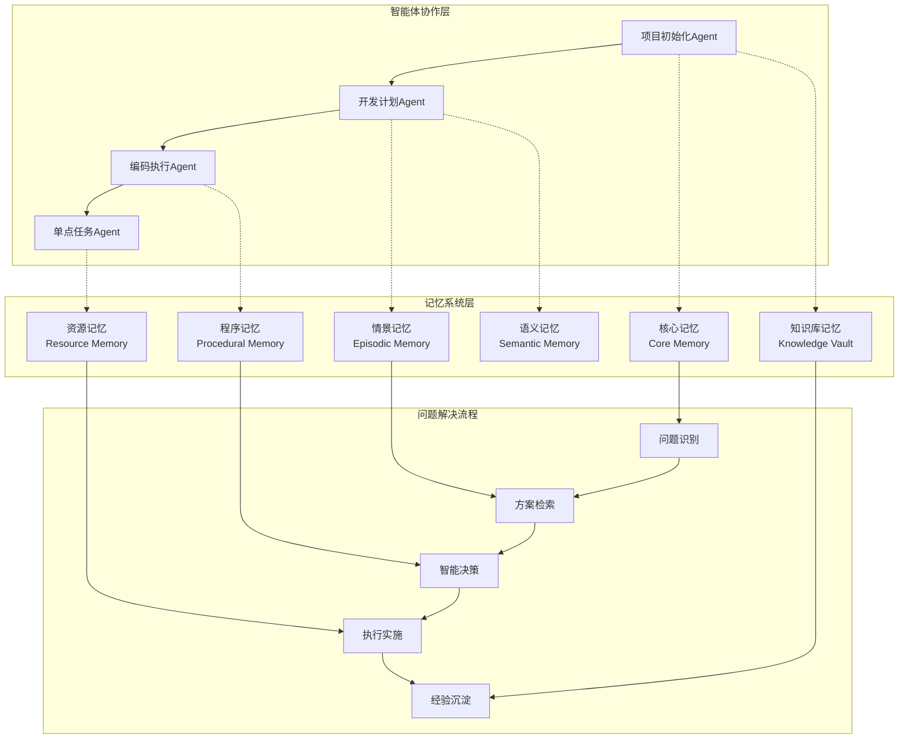
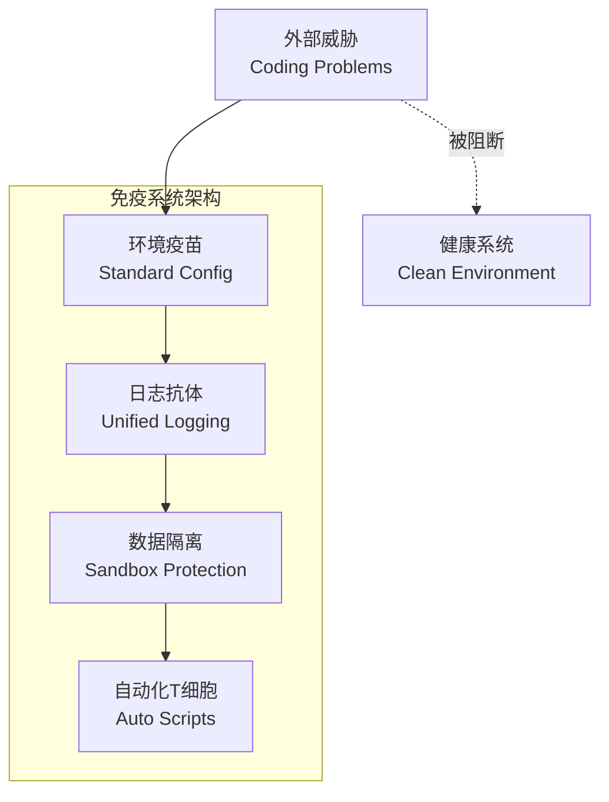
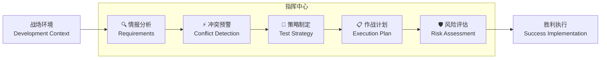
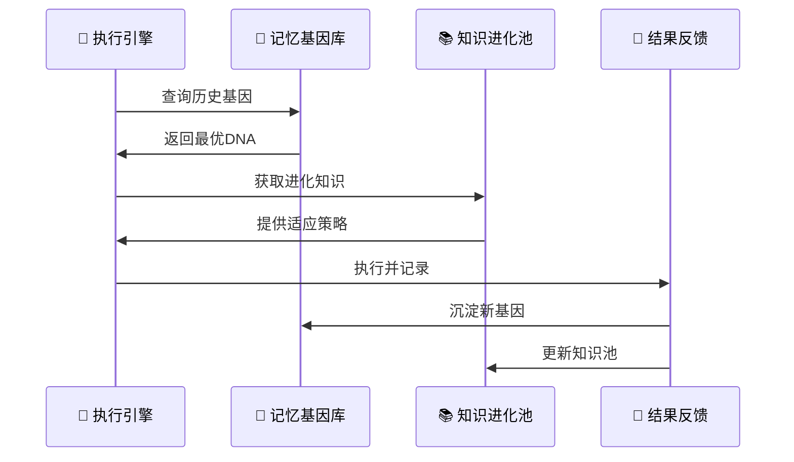
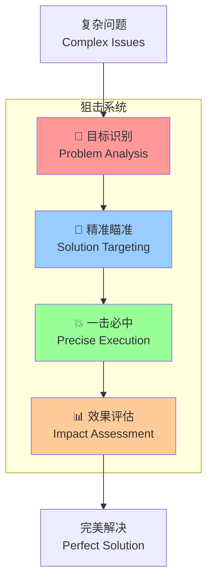
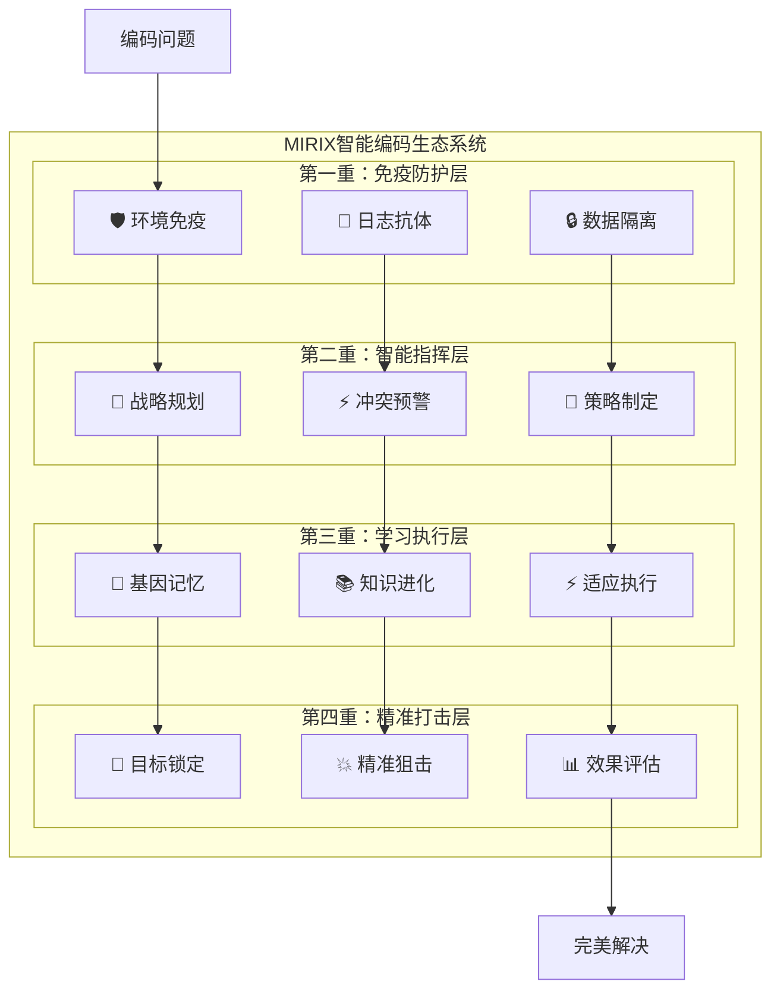
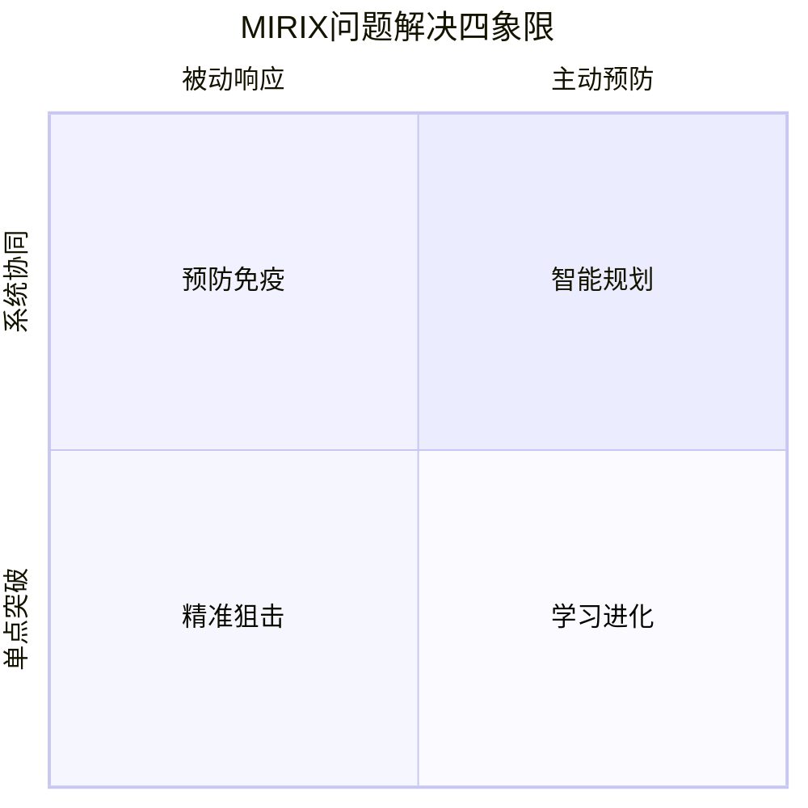
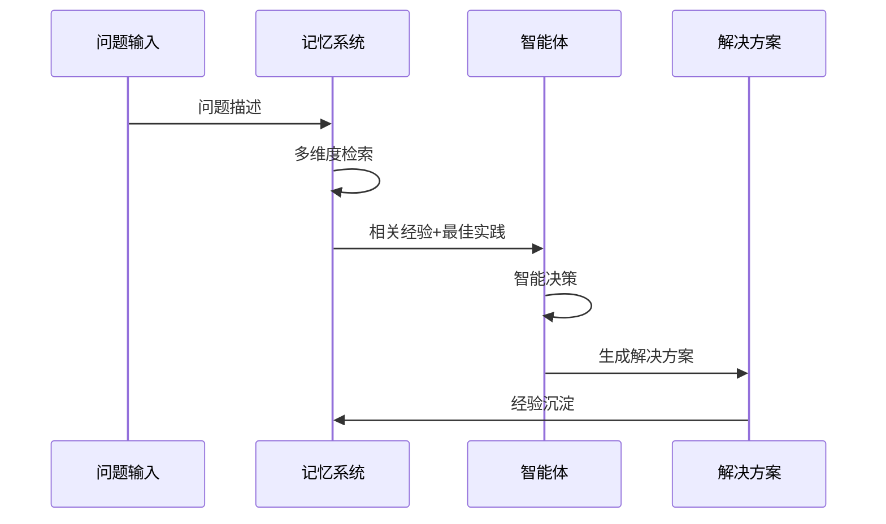

# MIRIX智能体协作解决编码问题

## 项目背景与痛点分析

MIRIX是一个多智能体个人助手系统，具备先进的记忆系统。在实际开发过程中，我们识别出9个核心编码问题，这些问题严重影响开发效率和代码质量：

### 核心痛点
1. **调试困难**: 日志信息不详细，问题定位耗时
2. **数据污染**: 不同任务间数据相互干扰，影响结果准确性  
3. **一致性问题**: 代码、文档、数据库间存在冲突
4. **知识断层**: 缺乏学习型开发模式，经验难以积累
5. **测试低效**: 缺乏针对性测试策略，重复劳动多
6. **技术盲区**: 面对新技术时缺乏有效的知识获取机制
7. **环境差异**: 跨平台开发环境不统一
8. **计划缺失**: 直接编码导致返工和质量问题
9. **重复劳动**: 缺乏自动化工具，手工操作效率低

## 智能体协作架构

MIRIX采用四层智能体协作架构，结合六类记忆系统，形成完整的问题解决生态：

## 核心解决机制：四重防护的智能编码生态

### 🛡️ 第一重防护：预防式免疫系统（项目初始化Agent）

> **方法论比喻**: 如同人体免疫系统，在病毒入侵前就建立防护屏障

**解决痛点**: 日志混乱、数据污染、环境差异、重复劳动

**核心机制 - "疫苗接种法"**:
- **环境疫苗**: 标准化配置模板，一次接种终身免疫
- **日志抗体**: 统一日志格式，问题追踪如血液检测般精准
- **数据隔离**: 每个任务独立沙盒，如细胞膜般严密防护

### 🧠 第二重防护：智能大脑规划系统（开发计划Agent）

> **方法论比喻**: 如同军事指挥部，运筹帷幄决胜千里

**解决痛点**: 一致性冲突、测试盲目、计划缺失

**核心机制 - "作战指挥法"**:
- **情报收集**: 全方位需求分析，如卫星侦察般精确
- **战略制定**: 冲突预判与化解，如棋局推演般深远
- **战术选择**: 差异化测试策略，如精准打击般高效

**智能战术矩阵**:
| 战场类型 | 作战策略 | 武器装备 | 预期效果 |
|---------|---------|---------|---------|
| 🐳 Docker战场 | 容器重建战术 | docker-compose | 环境一致性100% |
| 🌐 API战场 | IDE内置打击 | HTTP Client | 接口测试覆盖率95% |
| 🗄️ 数据库战场 | 事务回滚战术 | Transaction Control | 数据完整性保障 |
| 🎨 前端战场 | 自动化UI战术 | Selenium/Cypress | 用户体验验证 |

### ⚡第三重防护：学习型执行引擎（编码执行Agent）

> **方法论比喻**: 如同进化中的生物，每次执行都变得更强大

**解决痛点**: 知识断层、技术盲区

**核心机制 - "进化学习法"**:
- **基因记忆**: 每次执行都留下"DNA"痕迹，供后续进化参考
- **适应性变异**: 根据环境变化调整策略，如物种适应般灵活
- **群体智慧**: 汇聚所有执行经验，形成集体智能

### 🎯 第四重防护：精准狙击系统（单点任务Agent）

> **方法论比喻**: 如同特种兵狙击手，一击必中解决关键问题

**解决痛点**: 具体技术难题的快速精准解决

**核心机制 - "狙击手法则"**:
- **目标锁定**: 精确识别问题核心，如热成像瞄准般准确
- **弹药选择**: 智能匹配最佳工具，如选择合适子弹般精准
- **一击必中**: 最小代价最大效果，如狙击手般高效

### 🌟 四重防护协同作战图

### 🎭 方法论精髓：MIRIX四象限法则

**四象限协同效应**:
- **象限1（智能规划）**: 主动预防 + 系统协同 = 战略制高点
- **象限2（预防免疫）**: 主动预防 + 单点突破 = 问题免疫力
- **象限3（精准狙击）**: 被动响应 + 单点突破 = 应急处理能力
- **象限4（学习进化）**: 被动响应 + 系统协同 = 持续进化能力

## 记忆系统赋能

### 六类记忆协同工作
1. **核心记忆**: 存储用户偏好和项目配置
2. **情景记忆**: 记录问题解决的时间序列
3. **程序记忆**: 保存标准化流程和最佳实践
4. **资源记忆**: 管理文档、代码模板等资源
5. **知识库记忆**: 存储技术知识和解决方案
6. **语义记忆**: 构建概念关联和推理能力

### 记忆驱动的问题解决流程

## 实施效果与价值

### 量化指标
- **开发效率**: 提升30%（减少重复工作和调试时间）
- **代码质量**: 缺陷率降低50%（预防式质量控制）
- **知识积累**: 每个项目产生可复用的解决方案库
- **团队协作**: 标准化流程减少沟通成本

### 核心价值
1. **系统性解决**: 从根源预防问题，而非被动修复
2. **智能化决策**: 基于历史经验的最优方案选择
3. **持续学习**: 每次问题解决都成为未来的知识资产
4. **标准化流程**: 确保团队协作的一致性和高效性

## 总结

MIRIX通过四层智能体协作架构和六类记忆系统，建立了完整的编码问题解决生态。核心创新在于：

1. **预防为主**: 通过标准化和环境配置预防问题发生
2. **智能决策**: 基于记忆系统的经验驱动决策
3. **持续进化**: 每次解决问题都增强系统能力
4. **全流程覆盖**: 从项目初始化到具体实施的完整链路

这种机制不仅解决了当前的9个核心编码问题，更重要的是建立了一个可持续进化的智能开发生态系统。