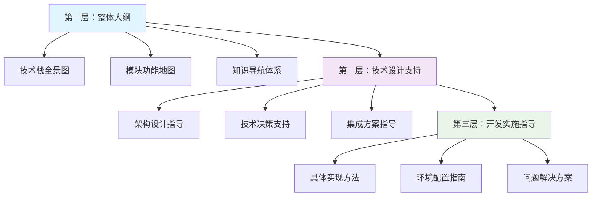

# MIRIX 项目知识文档体系

> 🎯 **知识工程师智能体构建的三层知识体系**  
> 为技术设计智能体和开发智能体提供完整的知识支撑

---

## 📋 知识体系概览

本知识文档体系采用**三层架构设计**，从宏观到微观，从概念到实施，为不同阶段的工作提供精准的知识支持：

---

## 🗂️ 知识文档结构

### 📁 核心模块知识 (`modules/`)
深入解析MIRIX系统的核心技术模块，提供完整的技术理解和实施指导。

| 模块文档 | 知识范围 | 支撑场景 |
|---------|---------|---------|
| [**ORM数据层**](modules/orm-data-layer.md) | 数据访问基础、模型设计、数据库操作 | 数据架构设计、数据模型开发 |
| [**API服务层**](modules/api-services.md) | FastAPI架构、接口设计、服务集成 | API架构设计、接口开发 |

### 🏗️ 系统架构知识 (`architecture/`)
系统级别的架构设计和技术决策支持，面向整体技术方案设计。

| 架构文档 | 知识范围 | 支撑场景 |
|---------|---------|---------|
| [**系统设计**](architecture/system-design.md) | 整体架构、技术选型、设计原则 | 系统架构设计、技术决策 |

### 🛠️ 实施指导知识 (`implementation/`)
具体的开发实施指导，面向实际编码和部署工作。

| 实施文档 | 知识范围 | 支撑场景 |
|---------|---------|---------|
| [**开发指南**](implementation/development-guide.md) | 环境配置、开发流程、代码实现 | 开发环境搭建、功能实现 |

### 🔧 问题解决知识 (`troubleshooting/`)
系统性的问题诊断和解决方案，面向运维和故障处理。

| 故障排除文档 | 知识范围 | 支撑场景 |
|------------|---------|---------|
| [**问题解决指南**](troubleshooting/problem-solving-guide.md) | 故障诊断、性能优化、应急处理 | 问题排查、系统维护 |

---

## 🎯 按使用场景导航

### 🔍 技术调研阶段
**目标**: 了解技术栈特性，进行技术选型和可行性分析

**推荐路径**:
1. 📖 [系统设计 - 技术栈概览](architecture/system-design.md#技术栈概览)
2. 📖 [ORM数据层 - 技术选型](modules/orm-data-layer.md#技术选型)
3. 📖 [API服务层 - 架构概览](modules/api-services.md#架构概览)

### 🏗️ 架构设计阶段
**目标**: 设计系统架构，制定技术方案和集成策略

**推荐路径**:
1. 📖 [系统设计 - 整体架构](architecture/system-design.md#整体架构)
2. 📖 [系统设计 - 核心设计原则](architecture/system-design.md#核心设计原则)
3. 📖 [ORM数据层 - 架构设计](modules/orm-data-layer.md#架构设计)
4. 📖 [API服务层 - 技术设计支持](modules/api-services.md#技术设计支持)

### 💻 开发实施阶段
**目标**: 搭建开发环境，实现具体功能，编写和测试代码

**推荐路径**:
1. 📖 [开发指南 - 环境配置](implementation/development-guide.md#环境配置)
2. 📖 [开发指南 - 开发流程](implementation/development-guide.md#开发流程)
3. 📖 [ORM数据层 - 开发实施指导](modules/orm-data-layer.md#开发实施指导)
4. 📖 [API服务层 - 开发实施指导](modules/api-services.md#开发实施指导)

### 🚀 部署运维阶段
**目标**: 部署系统，监控运行状态，处理故障和性能问题

**推荐路径**:
1. 📖 [开发指南 - 部署配置](implementation/development-guide.md#部署配置)
2. 📖 [系统设计 - 部署架构](architecture/system-design.md#部署架构)
3. 📖 [问题解决指南 - 系统监控](troubleshooting/problem-solving-guide.md#系统监控)

### 🔧 故障排查阶段
**目标**: 诊断系统问题，快速定位和解决故障

**推荐路径**:
1. 📖 [问题解决指南 - 快速诊断](troubleshooting/problem-solving-guide.md#快速诊断)
2. 📖 [问题解决指南 - 常见问题索引](troubleshooting/problem-solving-guide.md#常见问题快速索引)
3. 📖 [问题解决指南 - 紧急故障处理](troubleshooting/problem-solving-guide.md#紧急故障处理流程)

---

## 🔍 按技术栈导航

### 🐍 Python 后端技术
- **FastAPI框架**: [API服务层 - FastAPI架构](modules/api-services.md#fastapi架构)
- **SQLAlchemy ORM**: [ORM数据层 - SQLAlchemy设计](modules/orm-data-layer.md#sqlalchemy设计)
- **Pydantic数据验证**: [API服务层 - 数据模型](modules/api-services.md#数据模型)
- **异步编程**: [系统设计 - 异步架构](architecture/system-design.md#异步架构)

### 🗄️ 数据库技术
- **PostgreSQL**: [ORM数据层 - PostgreSQL配置](modules/orm-data-layer.md#postgresql配置)
- **pgvector向量存储**: [ORM数据层 - 向量存储](modules/orm-data-layer.md#向量存储)
- **Redis缓存**: [系统设计 - 缓存策略](architecture/system-design.md#缓存策略)
- **数据库迁移**: [开发指南 - 数据库管理](implementation/development-guide.md#数据库管理)

### 🌐 API和集成技术
- **RESTful API**: [API服务层 - RESTful设计](modules/api-services.md#restful设计)
- **Server-Sent Events**: [API服务层 - SSE实现](modules/api-services.md#sse实现)
- **MCP协议**: [API服务层 - MCP集成](modules/api-services.md#mcp集成)
- **OpenAI集成**: [系统设计 - LLM集成](architecture/system-design.md#llm集成)

### 🐳 部署和运维技术
- **Docker容器化**: [开发指南 - Docker部署](implementation/development-guide.md#docker部署)
- **Kubernetes编排**: [开发指南 - K8s配置](implementation/development-guide.md#k8s配置)
- **日志管理**: [系统设计 - 日志系统](architecture/system-design.md#日志系统)
- **监控告警**: [问题解决指南 - 性能监控](troubleshooting/problem-solving-guide.md#性能监控)

---

## 🎨 按功能模块导航

### 👤 用户和权限管理
- **用户模型**: [ORM数据层 - User模型](modules/orm-data-layer.md#user模型)
- **认证授权**: [API服务层 - 认证中间件](modules/api-services.md#认证中间件)
- **权限控制**: [系统设计 - 安全架构](architecture/system-design.md#安全架构)

### 🤖 智能体管理
- **Agent模型**: [ORM数据层 - Agent模型](modules/orm-data-layer.md#agent模型)
- **Agent API**: [API服务层 - Agent管理](modules/api-services.md#agent管理)
- **Agent服务**: [开发指南 - AgentService](implementation/development-guide.md#agentservice)

### 💬 消息和对话
- **Message模型**: [ORM数据层 - Message模型](modules/orm-data-layer.md#message模型)
- **流式对话**: [API服务层 - 流式消息](modules/api-services.md#流式消息)
- **对话服务**: [开发指南 - MessageService](implementation/development-guide.md#messageservice)

### 🧠 记忆系统
- **记忆模型**: [ORM数据层 - 记忆模型](modules/orm-data-layer.md#记忆模型)
- **向量存储**: [ORM数据层 - 向量数据库](modules/orm-data-layer.md#向量数据库)
- **记忆检索**: [系统设计 - 记忆架构](architecture/system-design.md#记忆架构)

### 📄 文档处理
- **文档上传**: [API服务层 - 文档处理](modules/api-services.md#文档处理)
- **文档解析**: [系统设计 - 文档处理流程](architecture/system-design.md#文档处理流程)
- **MCP工具集成**: [API服务层 - MCP工具](modules/api-services.md#mcp工具)

---

## 📊 知识质量保证

### ✅ 知识验证标准
- **准确性**: 所有技术信息均基于官方文档和实际代码验证
- **完整性**: 覆盖从概念理解到具体实施的完整知识链条
- **实用性**: 提供可直接应用的代码示例和配置模板
- **时效性**: 基于当前项目状态，保持版本一致性

### 🔄 知识更新机制
- **版本跟踪**: 跟踪技术栈版本变化，及时更新相关知识
- **反馈收集**: 收集使用过程中的问题和改进建议
- **持续完善**: 根据项目发展持续补充和优化知识内容

### 📈 使用效果评估
- **查找效率**: 通过多维度导航快速定位所需知识
- **理解深度**: 分层次提供不同详细程度的知识内容
- **应用便利**: 提供直接可用的代码示例和配置模板

---

## 🚀 快速开始

### 🎯 新手入门路径
1. **了解项目**: 阅读 [系统设计概览](architecture/system-design.md#项目概述)
2. **搭建环境**: 跟随 [开发指南快速开始](implementation/development-guide.md#快速开始)
3. **理解架构**: 学习 [核心模块架构](modules/orm-data-layer.md#架构概览)
4. **动手实践**: 参考 [API开发示例](modules/api-services.md#开发示例)

### 🔧 开发者路径
1. **技术选型**: 查看 [技术栈分析](architecture/system-design.md#技术栈)
2. **架构设计**: 参考 [系统架构设计](architecture/system-design.md#架构设计)
3. **模块开发**: 使用 [模块开发指南](implementation/development-guide.md#模块开发)
4. **测试部署**: 遵循 [测试和部署流程](implementation/development-guide.md#测试部署)

### 🛠️ 运维人员路径
1. **部署配置**: 学习 [部署架构](architecture/system-design.md#部署架构)
2. **监控设置**: 配置 [系统监控](troubleshooting/problem-solving-guide.md#系统监控)
3. **故障处理**: 掌握 [故障排查流程](troubleshooting/problem-solving-guide.md#故障处理流程)
4. **性能优化**: 实施 [性能优化策略](troubleshooting/problem-solving-guide.md#性能优化)

---

## 📞 支持和反馈

### 🤝 获取帮助
- **文档问题**: 如果发现文档错误或不清楚的地方，请提交Issue
- **技术问题**: 参考相应的故障排除指南或寻求技术支持
- **功能建议**: 欢迎提出改进建议和新功能需求

### 📝 贡献指南
- **内容更新**: 发现过时信息时，欢迎提交更新
- **知识补充**: 可以补充缺失的技术细节或使用案例
- **结构优化**: 建议改进文档结构和导航方式

---

## 📚 相关资源

### 🔗 官方文档链接
- [FastAPI官方文档](https://fastapi.tiangolo.com/)
- [SQLAlchemy官方文档](https://docs.sqlalchemy.org/)
- [PostgreSQL官方文档](https://www.postgresql.org/docs/)
- [Docker官方文档](https://docs.docker.com/)

### 🛠️ 开发工具
- [VS Code](https://code.visualstudio.com/) - 推荐的开发IDE
- [DBeaver](https://dbeaver.io/) - 数据库管理工具
- [Postman](https://www.postman.com/) - API测试工具
- [Docker Desktop](https://www.docker.com/products/docker-desktop) - 容器化开发环境

---

**🎯 记住**: 这个知识体系是为了支撑高效的技术工作而构建的。根据你的具体需求选择合适的导航路径，从概念理解到具体实施，每个层次都有相应的知识支持。遇到问题时，优先查看故障排除指南，大多数常见问题都有标准的解决方案。

**📈 持续改进**: 知识体系会随着项目发展持续更新和完善。你的使用反馈是我们改进的重要依据，欢迎随时提出建议和意见。
- **按功能导航**：[记忆管理](./modules/memory-system.md) | [智能体系统](./modules/agent-system.md) | [API服务](./modules/api-services.md)
- **按技术导航**：[后端架构](./architecture/backend.md) | [前端界面](./architecture/frontend.md) | [数据存储](./architecture/database.md)
- **按场景导航**：[开发环境](./guides/development.md) | [部署运维](./guides/deployment.md) | [扩展开发](./guides/extension.md)

---

### 第二层：技术设计支持 - 架构决策指导

#### 🏛️ 系统架构设计
- [整体架构设计](./architecture/system-architecture.md) - 分层微服务架构模式
- [多智能体协调机制](./architecture/multi-agent-coordination.md) - Agent间通信和任务分配
- [记忆系统架构](./architecture/memory-architecture.md) - 六层记忆模型设计
- [数据流转设计](./architecture/data-flow.md) - 消息处理和状态管理

#### 🔧 技术选型指导
- [LLM集成策略](./design/llm-integration.md) - 多模型支持和切换机制
- [数据存储方案](./design/storage-design.md) - PostgreSQL + pgvector + Redis
- [搜索引擎设计](./design/search-engine.md) - BM25 + 向量相似度混合搜索
- [安全架构设计](./design/security-architecture.md) - 隐私保护和数据安全

#### 🔗 集成方案指导
- [MCP协议集成](./integration/mcp-integration.md) - Model Context Protocol实现
- [第三方服务集成](./integration/third-party.md) - 外部API和工具集成
- [插件扩展机制](./integration/plugin-system.md) - 功能扩展和定制化

---

### 第三层：开发实施指导 - 具体实现方法

#### 🚀 环境配置指南
- [开发环境搭建](./guides/development-setup.md) - 本地开发环境配置
- [Docker部署指南](./guides/docker-deployment.md) - 容器化部署方案
- [数据库初始化](./guides/database-setup.md) - PostgreSQL和Redis配置

#### 💻 核心模块实现
- [Agent系统实现](./implementation/agent-implementation.md) - 智能体核心逻辑
- [记忆管理实现](./implementation/memory-implementation.md) - 记忆存储和检索
- [API服务实现](./implementation/api-implementation.md) - RESTful API和SSE
- [前端界面实现](./implementation/frontend-implementation.md) - React + Electron桌面应用

#### 🔍 问题解决指南
- [常见问题解答](./troubleshooting/faq.md) - 开发和部署常见问题
- [性能优化指南](./troubleshooting/performance.md) - 系统性能调优
- [调试方法指南](./troubleshooting/debugging.md) - 问题诊断和调试技巧

---

## 🔍 快速查找索引

### 按关键词查找
- **Agent**: [智能体系统](./modules/agent-system.md) | [多智能体协调](./architecture/multi-agent-coordination.md)
- **Memory**: [记忆系统](./modules/memory-system.md) | [记忆架构](./architecture/memory-architecture.md)
- **API**: [API服务](./modules/api-services.md) | [API实现](./implementation/api-implementation.md)
- **Database**: [数据存储](./architecture/database.md) | [数据库配置](./guides/database-setup.md)
- **Docker**: [Docker部署](./guides/docker-deployment.md) | [容器化方案](./architecture/deployment.md)

### 按问题类型查找
- **安装配置**: [环境搭建](./guides/development-setup.md) | [Docker部署](./guides/docker-deployment.md)
- **功能开发**: [核心模块实现](./implementation/) | [扩展开发](./guides/extension.md)
- **性能问题**: [性能优化](./troubleshooting/performance.md) | [系统监控](./guides/monitoring.md)
- **集成问题**: [第三方集成](./integration/third-party.md) | [MCP集成](./integration/mcp-integration.md)

### 按技术栈查找
- **Python后端**: [后端架构](./architecture/backend.md) | [Agent实现](./implementation/agent-implementation.md)
- **React前端**: [前端架构](./architecture/frontend.md) | [界面实现](./implementation/frontend-implementation.md)
- **PostgreSQL**: [数据库设计](./architecture/database.md) | [数据库配置](./guides/database-setup.md)
- **Docker**: [容器化部署](./guides/docker-deployment.md) | [生产环境](./guides/production.md)

---

## 📖 文档使用说明

### 阅读建议
1. **新手入门**：建议从第一层整体大纲开始，了解项目全貌
2. **架构设计**：重点阅读第二层技术设计支持，理解设计决策
3. **具体开发**：参考第三层开发实施指导，获取实现细节

### 文档维护
- 文档版本与代码版本同步更新
- 每个模块都包含版本信息和更新日期
- 提供反馈渠道和改进建议

### 贡献指南
- 欢迎提交文档改进建议
- 遵循现有文档结构和格式
- 确保技术信息的准确性和时效性

---

**最后更新**: 2024年12月
**文档版本**: v0.1.4
**维护者**: MIRIX开发团队