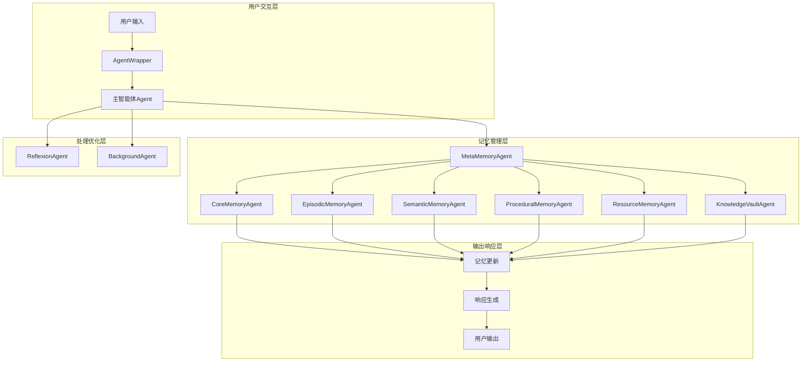

# MIRIX 智能体系统知识文档

## 模块概览

MIRIX智能体系统是项目的核心组件，实现了基于多智能体架构的记忆管理和任务处理机制。系统包含9种专门化智能体，每个智能体负责特定的记忆类型管理和功能实现。

**模块路径**: `mirix/agent/`  
**核心文件**: `agent.py`, `agent_wrapper.py`, `agent_states.py`  
**版本**: v0.1.4  

---

## 第一层：整体大纲

### 🧠 智能体架构概览

#### 核心智能体类型
1. **主智能体（Agent）** - 核心协调和对话处理
2. **核心记忆智能体（CoreMemoryAgent）** - 用户基本信息管理
3. **情景记忆智能体（EpisodicMemoryAgent）** - 时间序列事件记录
4. **语义记忆智能体（SemanticMemoryAgent）** - 概念知识管理
5. **程序记忆智能体（ProceduralMemoryAgent）** - 操作步骤管理
6. **资源记忆智能体（ResourceMemoryAgent）** - 文件资源管理
7. **知识库智能体（KnowledgeVaultAgent）** - 结构化知识管理
8. **元记忆智能体（MetaMemoryAgent）** - 记忆分析和分类
9. **反思智能体（ReflexionAgent）** - 自我反思和优化
10. **后台智能体（BackgroundAgent）** - 后台任务处理

#### 智能体协作模式


#### 关键特性
- **分布式记忆管理**：每种记忆类型由专门智能体管理
- **智能任务分配**：根据输入内容自动分配给合适的智能体
- **协同工作机制**：多个智能体可同时处理复杂任务
- **状态持久化**：智能体状态自动保存和恢复
- **动态扩展能力**：支持新增自定义智能体类型

---

## 第二层：技术设计支持

### 🏗️ 架构设计原则

#### 设计理念
- **单一职责原则**：每个智能体专注于特定类型的记忆管理
- **开闭原则**：支持新增智能体类型而不修改现有代码
- **依赖倒置原则**：通过接口和抽象类实现松耦合
- **组合优于继承**：通过组合模式实现智能体协作

#### 核心设计模式
1. **策略模式**：不同记忆类型使用不同的存储和检索策略
2. **观察者模式**：智能体间通过事件机制进行通信
3. **工厂模式**：动态创建和管理智能体实例
4. **代理模式**：AgentWrapper作为智能体的统一代理接口

### 🔧 技术选型依据

#### LLM集成策略
- **多模型支持**：OpenAI GPT、Anthropic Claude、Google Gemini
- **模型切换机制**：根据任务类型和成本考虑选择最适合的模型
- **Token管理**：智能的上下文窗口管理和消息摘要
- **错误处理**：完善的API调用失败重试和降级机制

#### 状态管理设计
- **持久化存储**：使用SQLAlchemy ORM进行状态持久化
- **内存缓存**：关键状态信息的内存缓存优化
- **状态同步**：多智能体间的状态同步机制
- **版本控制**：智能体状态的版本管理和回滚

#### 性能优化考量
- **异步处理**：支持异步任务处理和并发执行
- **连接池管理**：数据库连接池和LLM API连接复用
- **缓存策略**：多层缓存机制提升响应速度
- **资源限制**：内存和计算资源的合理分配

### 🔗 集成方案设计

#### 内部模块集成
- **ORM集成**：与数据模型层的紧密集成
- **服务层集成**：与业务服务层的协调工作
- **API层集成**：为上层API提供统一的智能体接口

#### 外部系统集成
- **MCP协议支持**：Model Context Protocol的实现
- **工具系统集成**：与外部工具和API的集成机制
- **插件扩展接口**：支持第三方插件的集成

---

## 第三层：开发实施指导

### 🚀 核心类实现详解

#### 主智能体类（Agent）
```python
# 文件位置: mirix/agent/agent.py
class Agent(BaseAgent):
    """
    MIRIX主智能体类，负责核心对话处理和智能体协调
    
    核心功能：
    - 用户消息处理和响应生成
    - 记忆检索和更新协调
    - 工具调用和执行管理
    - 上下文窗口管理和优化
    """
    
    def __init__(self, interface: AgentInterface, agent_state: AgentState, 
                 user: User, llm_config: LLMConfig):
        """
        初始化主智能体
        
        Args:
            interface: 智能体接口，处理消息输入输出
            agent_state: 智能体状态，包含记忆和配置信息
            user: 用户信息
            llm_config: LLM配置信息
        """
        super().__init__(interface, agent_state, user, llm_config)
        
        # 初始化记忆管理器
        self.episodic_memory_manager = EpisodicMemoryManager()
        self.semantic_memory_manager = SemanticMemoryManager()
        self.procedural_memory_manager = ProceduralMemoryManager()
        self.resource_memory_manager = ResourceMemoryManager()
        
        # 初始化工具执行沙盒
        self.tool_execution_sandbox = ToolExecutionSandbox()
    
    def step(self, input_messages: List[Message], 
             chaining: bool = True, max_chaining_steps: int = None) -> MirixUsageStatistics:
        """
        智能体核心步进函数
        
        处理流程：
        1. 消息预处理和验证
        2. 记忆检索和上下文构建
        3. LLM推理和响应生成
        4. 工具调用和执行
        5. 记忆更新和状态保存
        
        Args:
            input_messages: 输入消息列表
            chaining: 是否启用链式调用
            max_chaining_steps: 最大链式调用步数
            
        Returns:
            MirixUsageStatistics: 使用统计信息
        """
        # 实现核心步进逻辑
        pass
    
    def _get_ai_reply(self, message_sequence: List[Message]) -> ChatCompletionResponse:
        """
        获取LLM响应的核心方法
        
        功能：
        - 构建包含记忆上下文的提示词
        - 调用LLM API获取响应
        - 处理工具调用和函数执行
        - 错误处理和重试机制
        """
        # 实现LLM调用逻辑
        pass
    
    def build_system_prompt_with_memories(self, raw_system: str, 
                                        topics: List[str], 
                                        retrieved_memories: Dict) -> str:
        """
        构建包含记忆上下文的系统提示词
        
        功能：
        - 整合不同类型的记忆内容
        - 根据相关性排序记忆片段
        - 控制提示词长度和质量
        """
        # 实现提示词构建逻辑
        pass
```

#### 智能体包装器（AgentWrapper）
```python
# 文件位置: mirix/agent/agent_wrapper.py
class AgentWrapper:
    """
    智能体包装器，提供统一的智能体访问接口
    
    功能：
    - 智能体生命周期管理
    - 配置加载和验证
    - 错误处理和日志记录
    - 性能监控和统计
    """
    
    def __init__(self, config_path: str):
        """
        初始化智能体包装器
        
        Args:
            config_path: 配置文件路径
        """
        self.config = self._load_config(config_path)
        self.agent = self._create_agent()
        self.logger = get_logger(__name__)
    
    def send_message(self, message: str, memorizing: bool = True, 
                    force_absorb_content: bool = False) -> str:
        """
        发送消息给智能体
        
        Args:
            message: 用户消息内容
            memorizing: 是否启用记忆功能
            force_absorb_content: 是否强制吸收内容到记忆
            
        Returns:
            str: 智能体响应内容
        """
        # 实现消息发送逻辑
        pass
    
    def _create_agent(self) -> Agent:
        """创建智能体实例"""
        # 实现智能体创建逻辑
        pass
```

### 🔧 记忆智能体实现

#### 情景记忆智能体
```python
# 文件位置: mirix/agent/episodic_memory_agent.py
class EpisodicMemoryAgent:
    """
    情景记忆智能体，管理时间序列相关的记忆
    
    功能：
    - 事件时间戳记录
    - 时间相关性检索
    - 记忆衰减管理
    - 重要事件标记
    """
    
    def store_episode(self, content: str, timestamp: datetime, 
                     importance: float = 1.0) -> str:
        """
        存储情景记忆
        
        Args:
            content: 记忆内容
            timestamp: 时间戳
            importance: 重要性评分
            
        Returns:
            str: 记忆ID
        """
        # 实现情景记忆存储逻辑
        pass
    
    def retrieve_by_timerange(self, start_time: datetime, 
                            end_time: datetime, limit: int = 10) -> List[Dict]:
        """
        按时间范围检索记忆
        
        Args:
            start_time: 开始时间
            end_time: 结束时间
            limit: 返回数量限制
            
        Returns:
            List[Dict]: 记忆列表
        """
        # 实现时间范围检索逻辑
        pass
```

#### 语义记忆智能体
```python
# 文件位置: mirix/agent/semantic_memory_agent.py
class SemanticMemoryAgent:
    """
    语义记忆智能体，管理概念性知识和事实信息
    
    功能：
    - 概念关系建模
    - 语义相似度检索
    - 知识图谱构建
    - 事实验证和更新
    """
    
    def store_concept(self, concept: str, description: str, 
                     relations: List[str] = None) -> str:
        """
        存储概念记忆
        
        Args:
            concept: 概念名称
            description: 概念描述
            relations: 相关概念列表
            
        Returns:
            str: 概念ID
        """
        # 实现概念记忆存储逻辑
        pass
    
    def retrieve_by_similarity(self, query: str, 
                             threshold: float = 0.7, 
                             limit: int = 10) -> List[Dict]:
        """
        基于语义相似度检索记忆
        
        Args:
            query: 查询内容
            threshold: 相似度阈值
            limit: 返回数量限制
            
        Returns:
            List[Dict]: 相似记忆列表
        """
        # 实现语义相似度检索逻辑
        pass
```

### 🔍 配置和使用示例

#### 基本配置文件
```yaml
# 文件位置: mirix/configs/mirix.yaml
agent_name: "mirix"
model_name: "gpt-4"

# LLM配置
llm_config:
  model: "gpt-4"
  model_endpoint: "https://api.openai.com/v1"
  model_endpoint_type: "openai"
  context_window: 8192
  
# 记忆配置
memory_config:
  episodic_memory:
    enabled: true
    max_entries: 10000
    decay_factor: 0.95
  
  semantic_memory:
    enabled: true
    similarity_threshold: 0.7
    max_entries: 5000
  
  procedural_memory:
    enabled: true
    max_procedures: 1000

# 工具配置
tools_config:
  enabled_tools:
    - "send_message"
    - "core_memory_append"
    - "core_memory_replace"
    - "archival_memory_insert"
    - "archival_memory_search"
```

#### 使用示例
```python
from mirix.agent import AgentWrapper

# 初始化智能体
agent = AgentWrapper("./mirix/configs/mirix.yaml")

# 基本对话
response = agent.send_message(
    message="你好，我是新用户，请记住我的名字是张三。",
    memorizing=True
)
print(response)

# 强制记忆吸收
response = agent.send_message(
    message="我的生日是1990年5月15日，这很重要。",
    memorizing=True,
    force_absorb_content=True
)
print(response)

# 查询记忆
response = agent.send_message(
    message="我的生日是什么时候？",
    memorizing=False
)
print(response)
```

### 🐛 常见问题和解决方案

#### 问题1：智能体初始化失败
**现象**：AgentWrapper创建时抛出配置错误
**原因**：配置文件格式错误或缺少必要参数
**解决方案**：
```python
# 检查配置文件格式
import yaml
with open("mirix/configs/mirix.yaml", 'r') as f:
    config = yaml.safe_load(f)
    print(config)

# 验证必要字段
required_fields = ['agent_name', 'model_name', 'llm_config']
for field in required_fields:
    if field not in config:
        print(f"缺少必要字段: {field}")
```

#### 问题2：记忆检索性能问题
**现象**：记忆检索响应时间过长
**原因**：记忆数据量过大，缺少索引优化
**解决方案**：
```python
# 启用记忆缓存
agent.config.memory_config.enable_cache = True
agent.config.memory_config.cache_size = 1000

# 调整检索参数
agent.config.memory_config.max_retrieval_results = 5
agent.config.memory_config.similarity_threshold = 0.8
```

#### 问题3：LLM API调用失败
**现象**：智能体响应时出现API错误
**原因**：API密钥错误或网络连接问题
**解决方案**：
```python
# 检查API配置
print(agent.config.llm_config.model_endpoint)
print(agent.config.llm_config.api_key[:10] + "...")

# 启用重试机制
agent.config.llm_config.max_retries = 3
agent.config.llm_config.retry_delay = 1.0
```

---

## 📊 性能监控和优化

### 关键性能指标
- **响应时间**：用户消息到智能体响应的时间
- **记忆检索时间**：记忆查询和检索的耗时
- **LLM调用时间**：API调用的响应时间
- **内存使用量**：智能体运行时的内存占用
- **并发处理能力**：同时处理的用户会话数量

### 优化建议
1. **启用记忆缓存**：缓存频繁访问的记忆内容
2. **调整批处理大小**：优化数据库查询的批处理参数
3. **使用连接池**：复用数据库和API连接
4. **异步处理**：对非关键任务使用异步处理
5. **定期清理**：清理过期的临时数据和缓存

---

**文档版本**: v0.1.4  
**最后更新**: 2024年12月  
**维护者**: MIRIX开发团队