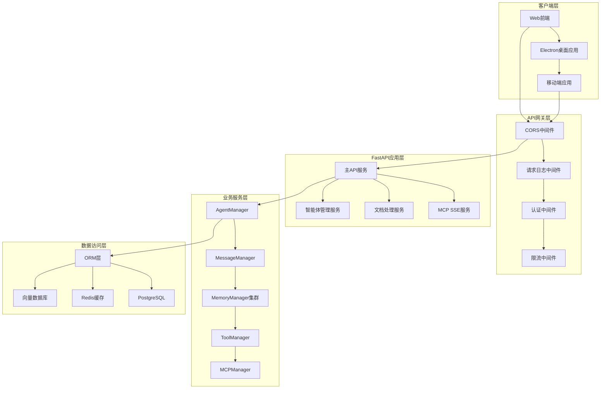
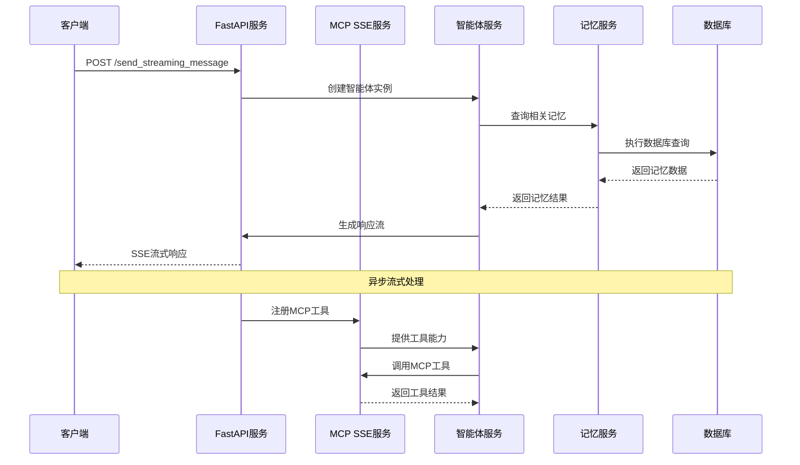
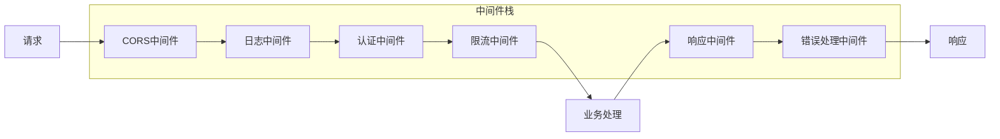

# MIRIX API服务层知识文档

## 模块概览

MIRIX API服务层基于FastAPI框架构建，提供RESTful API和SSE流式接口，支持多智能体管理、实时消息流、MCP协议集成和文档处理等核心功能。

**模块路径**: `mirix/server/` (主服务), `mcp_sse_service/` (MCP SSE服务)  
**核心文件**: `fastapi_server.py`, `server.py`, `routes.py`, `config.py`  
**版本**: v0.1.4  

---

## 第一层：整体大纲

### 🌐 API服务架构概览

#### 服务架构图


#### 核心API服务
1. **主API服务（FastAPI Server）**
   - 端口：47283
   - 功能：智能体管理、消息处理、文档上传
   - 协议：HTTP/HTTPS、WebSocket、SSE

2. **MCP SSE服务（MCP Server-Sent Events）**
   - 端口：8080
   - 功能：MCP协议支持、实时事件流
   - 协议：SSE、MCP Protocol

3. **抽象服务层（Server Abstract）**
   - 功能：多用户多智能体抽象接口
   - 设计：工厂模式、策略模式

#### 关键特性
- **异步处理**：基于FastAPI的异步请求处理
- **流式响应**：SSE支持实时消息流
- **多协议支持**：HTTP、WebSocket、MCP Protocol
- **中间件架构**：CORS、日志、认证、限流
- **微服务设计**：模块化服务组件
- **自动文档**：OpenAPI/Swagger自动生成

#### API端点分类
1. **智能体管理API**
   - `/agents/*` - 智能体CRUD操作
   - `/agents/{id}/memory` - 记忆管理
   - `/agents/{id}/config` - 配置管理

2. **消息处理API**
   - `/send_message` - 同步消息发送
   - `/send_streaming_message` - 流式消息处理
   - `/messages/*` - 消息历史管理

3. **文档处理API**
   - `/documents/upload` - 文档上传处理
   - `/documents/process` - 文档解析
   - `/documents/search` - 文档搜索

4. **MCP集成API**
   - `/mcp/marketplace` - MCP市场
   - `/mcp/servers` - MCP服务器管理
   - `/mcp/tools` - MCP工具管理

5. **系统管理API**
   - `/health` - 健康检查
   - `/config` - 系统配置
   - `/metrics` - 性能指标

---

## 第二层：技术设计支持

### 🏗️ API设计原则

#### 设计理念
- **RESTful设计**：遵循REST架构风格和HTTP语义
- **异步优先**：充分利用Python异步编程优势
- **流式处理**：支持大数据量的流式传输
- **错误处理**：统一的错误响应格式和异常处理
- **版本管理**：API版本控制和向后兼容

#### 核心设计模式
1. **依赖注入模式**：FastAPI的依赖注入系统
2. **中间件模式**：请求/响应处理管道
3. **工厂模式**：服务实例创建和管理
4. **观察者模式**：事件驱动的消息处理
5. **策略模式**：多种LLM提供商支持

### 🔧 技术选型依据

#### Web框架选择
- **FastAPI**：现代Python Web框架
  - 自动API文档生成
  - 类型提示和数据验证
  - 异步支持和高性能
  - 丰富的生态系统

#### 数据验证技术
- **Pydantic V2**：数据模型和验证
  - 运行时类型检查
  - 自动序列化/反序列化
  - 详细的错误信息
  - 高性能验证引擎

#### 异步处理技术
- **asyncio**：Python异步编程
- **uvicorn**：ASGI服务器
- **aiohttp**：异步HTTP客户端
- **asyncpg**：异步PostgreSQL驱动

#### 流式传输技术
- **Server-Sent Events (SSE)**：实时数据推送
- **WebSocket**：双向实时通信
- **Streaming Response**：大文件传输

### 🔗 服务集成架构

#### 服务间通信设计


#### 中间件处理流程


---

## 第三层：开发实施指导

### 🚀 FastAPI主服务实现

#### 1. 应用初始化和配置
```python
# 文件位置: mirix/server/fastapi_server.py
import os
import traceback
import base64
import tempfile
import json
import yaml
from pathlib import Path
from datetime import datetime
from typing import List, Optional, Dict, Any
from fastapi import FastAPI, HTTPException, File, UploadFile, Form, Depends
from fastapi.responses import StreamingResponse, HTMLResponse
from fastapi.middleware.cors import CORSMiddleware
from pydantic import BaseModel
import asyncio
import queue
import threading
import logging
import time

# 创建FastAPI应用实例
app = FastAPI(
    title="Mirix Agent API",
    version="0.1.4",
    description="MIRIX多智能体个人助手API服务",
    docs_url="/docs",
    redoc_url="/redoc"
)

# CORS中间件配置
app.add_middleware(
    CORSMiddleware,
    allow_origins=["*"],  # 生产环境应限制具体域名
    allow_credentials=True,
    allow_methods=["*"],
    allow_headers=["*"],
)

# 请求日志中间件
@app.middleware("http")
async def log_requests(request, call_next):
    """
    请求日志中间件，记录所有HTTP请求的详细信息
    
    功能：
    - 记录请求方法、URL、头部信息
    - 计算请求处理时间
    - 记录响应状态码
    - 异常情况的错误日志
    """
    start_time = time.time()
    logger.info(f"收到请求: {request.method} {request.url}")
    logger.debug(f"请求头: {dict(request.headers)}")
    
    try:
        response = await call_next(request)
        process_time = time.time() - start_time
        logger.info(
            f"请求完成: {request.method} {request.url} - "
            f"状态码: {response.status_code} - 耗时: {process_time:.4f}s"
        )
        return response
    except Exception as e:
        process_time = time.time() - start_time
        logger.error(
            f"请求异常: {request.method} {request.url} - "
            f"错误: {str(e)} - 耗时: {process_time:.4f}s"
        )
        raise

# 全局异常处理器
@app.exception_handler(HTTPException)
async def http_exception_handler(request, exc):
    """
    HTTP异常处理器，统一错误响应格式
    
    Args:
        request: FastAPI请求对象
        exc: HTTP异常对象
        
    Returns:
        JSONResponse: 标准化的错误响应
    """
    logger.error(f"HTTP异常: {exc.status_code} - {exc.detail}")
    return JSONResponse(
        status_code=exc.status_code,
        content={
            "error": True,
            "message": exc.detail,
            "status_code": exc.status_code,
            "timestamp": datetime.utcnow().isoformat()
        }
    )

@app.exception_handler(Exception)
async def general_exception_handler(request, exc):
    """
    通用异常处理器，处理未捕获的异常
    
    Args:
        request: FastAPI请求对象
        exc: 异常对象
        
    Returns:
        JSONResponse: 标准化的错误响应
    """
    logger.error(f"未处理异常: {str(exc)}")
    logger.error(f"异常堆栈: {traceback.format_exc()}")
    return JSONResponse(
        status_code=500,
        content={
            "error": True,
            "message": "内部服务器错误",
            "status_code": 500,
            "timestamp": datetime.utcnow().isoformat()
        }
    )
```

#### 2. 数据模型定义
```python
# 请求/响应数据模型
from pydantic import BaseModel, Field
from typing import List, Optional, Dict, Any
from datetime import datetime

class MessageRequest(BaseModel):
    """消息请求模型"""
    message: str = Field(..., description="用户消息内容")
    is_screen_monitoring: bool = Field(default=False, description="是否启用屏幕监控")
    stream: bool = Field(default=True, description="是否使用流式响应")
    metadata: Optional[Dict[str, Any]] = Field(default=None, description="附加元数据")

class MessageResponse(BaseModel):
    """消息响应模型"""
    success: bool = Field(..., description="请求是否成功")
    message: str = Field(..., description="响应消息")
    agent_id: Optional[str] = Field(None, description="智能体ID")
    timestamp: datetime = Field(default_factory=datetime.utcnow, description="响应时间戳")
    metadata: Optional[Dict[str, Any]] = Field(default=None, description="响应元数据")

class UploadDocumentRequest(BaseModel):
    """文档上传请求模型"""
    file_name: str = Field(..., description="文件名")
    file_type: str = Field(..., description="文件类型")
    content: str = Field(..., description="Base64编码的文件内容")
    user_id: str = Field(..., description="用户ID")
    description: Optional[str] = Field(None, description="文档描述")

class UploadDocumentResponse(BaseModel):
    """文档上传响应模型"""
    success: bool = Field(..., description="上传是否成功")
    message: str = Field(..., description="响应消息")
    document_id: Optional[str] = Field(None, description="文档ID")
    processed_content: Optional[Dict[str, Any]] = Field(None, description="处理后的内容信息")

class AgentConfigRequest(BaseModel):
    """智能体配置请求模型"""
    name: str = Field(..., description="智能体名称")
    agent_type: str = Field(..., description="智能体类型")
    llm_config: Dict[str, Any] = Field(..., description="LLM配置")
    memory_config: Optional[Dict[str, Any]] = Field(default=None, description="记忆配置")
    system_prompt: Optional[str] = Field(default=None, description="系统提示词")
    persona: Optional[str] = Field(default=None, description="人格设定")

class AgentConfigResponse(BaseModel):
    """智能体配置响应模型"""
    success: bool = Field(..., description="配置是否成功")
    agent_id: str = Field(..., description="智能体ID")
    config: Dict[str, Any] = Field(..., description="智能体配置信息")
```

#### 3. 核心API端点实现
```python
# 智能体管理API
@app.get("/agents", response_model=List[Dict[str, Any]])
async def list_agents(user_id: str = Query(..., description="用户ID")):
    """
    获取用户的智能体列表
    
    Args:
        user_id: 用户ID
        
    Returns:
        List[Dict]: 智能体列表
    """
    try:
        if agent is None:
            raise HTTPException(status_code=500, detail="智能体服务未初始化")
        
        # 获取用户的智能体列表
        agents_data = []
        # 这里应该从数据库查询用户的智能体
        # 示例实现
        agents_data.append({
            "id": agent.agent_state.id,
            "name": agent.agent_state.name,
            "type": agent.agent_state.agent_type,
            "created_at": agent.agent_state.created_at,
            "is_active": True
        })
        
        return agents_data
        
    except Exception as e:
        logger.error(f"获取智能体列表失败: {str(e)}")
        raise HTTPException(status_code=500, detail=f"获取智能体列表失败: {str(e)}")

@app.post("/agents", response_model=AgentConfigResponse)
async def create_agent(request: AgentConfigRequest):
    """
    创建新的智能体
    
    Args:
        request: 智能体配置请求
        
    Returns:
        AgentConfigResponse: 创建结果
    """
    try:
        # 创建智能体配置
        from mirix.schemas.agent import CreateAgent, AgentType
        from mirix.schemas.llm_config import LLMConfig
        
        create_request = CreateAgent(
            name=request.name,
            agent_type=AgentType(request.agent_type),
            llm_config=LLMConfig.model_validate(request.llm_config),
            memory_config=request.memory_config,
            system_prompt=request.system_prompt,
            persona=request.persona
        )
        
        # 这里应该调用智能体管理服务创建智能体
        # agent_state = agent_manager.create_agent(create_request, current_user)
        
        return AgentConfigResponse(
            success=True,
            agent_id="new_agent_id",  # 实际应该是创建的智能体ID
            config=request.model_dump()
        )
        
    except Exception as e:
        logger.error(f"创建智能体失败: {str(e)}")
        raise HTTPException(status_code=500, detail=f"创建智能体失败: {str(e)}")

# 流式消息处理API
@app.post("/send_streaming_message")
async def send_streaming_message_endpoint(request: MessageRequest):
    """
    发送消息并返回流式响应
    
    Args:
        request: 消息请求
        
    Returns:
        StreamingResponse: SSE流式响应
    """
    if agent is None:
        raise HTTPException(status_code=500, detail="智能体未初始化")
    
    # 检查API密钥
    api_key_check = check_missing_api_keys(agent)
    if "error" in api_key_check:
        raise HTTPException(status_code=500, detail=api_key_check["error"][0])

    if api_key_check["missing_keys"]:
        # 返回缺失API密钥的SSE事件
        async def missing_keys_response():
            yield f"data: {json.dumps({
                'type': 'missing_api_keys', 
                'missing_keys': api_key_check['missing_keys'], 
                'model_type': api_key_check['model_type']
            })}\n\n"
        
        return StreamingResponse(
            missing_keys_response(),
            media_type="text/event-stream",
            headers={
                "Cache-Control": "no-cache",
                "Connection": "keep-alive",
                "Content-Type": "text/event-stream",
            }
        )
    
    # 更新智能体系统提示词
    agent.update_chat_agent_system_prompt(request.is_screen_monitoring)
    
    async def generate_stream():
        """
        生成SSE流式响应
        
        Yields:
            str: SSE格式的数据
        """
        try:
            # 发送开始事件
            yield f"data: {json.dumps({'type': 'start', 'message': '开始处理消息'})}\n\n"
            
            # 处理消息并生成流式响应
            message_queue = queue.Queue()
            
            def message_callback(message_type: str, content: str, metadata: Dict = None):
                """消息回调函数"""
                message_queue.put({
                    'type': message_type,
                    'content': content,
                    'metadata': metadata or {}
                })
            
            # 在后台线程中处理消息
            def process_message():
                try:
                    # 调用智能体处理消息
                    response = agent.step(
                        user_message=request.message,
                        chaining=True,
                        ms=None,
                        callback=message_callback
                    )
                    
                    # 发送最终响应
                    message_queue.put({
                        'type': 'final_response',
                        'content': response,
                        'metadata': {'finished': True}
                    })
                    
                except Exception as e:
                    logger.error(f"消息处理异常: {str(e)}")
                    message_queue.put({
                        'type': 'error',
                        'content': f"处理消息时发生错误: {str(e)}",
                        'metadata': {'error': True}
                    })
                finally:
                    message_queue.put(None)  # 结束标记
            
            # 启动处理线程
            processing_thread = threading.Thread(target=process_message)
            processing_thread.start()
            
            # 流式输出消息
            while True:
                try:
                    message = message_queue.get(timeout=1)
                    if message is None:  # 结束标记
                        break
                    
                    # 发送SSE事件
                    yield f"data: {json.dumps(message)}\n\n"
                    
                except queue.Empty:
                    # 发送心跳事件
                    yield f"data: {json.dumps({'type': 'heartbeat'})}\n\n"
                    continue
            
            # 发送结束事件
            yield f"data: {json.dumps({'type': 'end', 'message': '消息处理完成'})}\n\n"
            
        except Exception as e:
            logger.error(f"流式响应生成异常: {str(e)}")
            yield f"data: {json.dumps({
                'type': 'error', 
                'message': f'流式响应异常: {str(e)}'
            })}\n\n"
    
    try:
        return StreamingResponse(
            generate_stream(),
            media_type="text/event-stream",
            headers={
                "Cache-Control": "no-cache",
                "Connection": "keep-alive",
                "Content-Type": "text/event-stream",
                "Access-Control-Allow-Origin": "*",
                "Access-Control-Allow-Headers": "*",
            }
        )
    except Exception as e:
        logger.error(f"流式消息端点异常: {str(e)}")
        raise HTTPException(status_code=500, detail=f"流式响应错误: {str(e)}")
```

#### 4. 文档处理API实现
```python
@app.post("/documents/upload", response_model=UploadDocumentResponse)
async def upload_document(request: UploadDocumentRequest):
    """
    上传文档并处理为记忆数据
    
    支持格式：markdown、txt、excel、pdf等
    集成MCP服务进行文档处理和记忆存储
    
    Args:
        request: 文档上传请求
        
    Returns:
        UploadDocumentResponse: 上传处理结果
    """
    logger.info(f"=== 文档上传请求开始 ===")
    logger.info(f"文件名: {request.file_name}")
    logger.info(f"文件类型: {request.file_type}")
    logger.info(f"用户ID: {request.user_id}")
    logger.info(f"内容长度: {len(request.content) if request.content else 0}")
    
    if agent is None:
        logger.error("智能体未初始化")
        raise HTTPException(status_code=500, detail="智能体未初始化")
    
    try:
        # 解码Base64内容
        try:
            file_content = base64.b64decode(request.content)
            logger.info(f"Base64解码成功，内容长度: {len(file_content)}")
        except Exception as e:
            logger.error(f"Base64解码失败: {e}")
            raise HTTPException(status_code=400, detail="文件内容解码失败")
        
        # 初始化文档处理器
        from mirix.services.document_processor import DocumentProcessor
        document_processor = DocumentProcessor()
        
        # 检查文件格式支持
        if not document_processor.is_supported_format(request.file_name):
            supported_formats = list(document_processor.SUPPORTED_FORMATS.keys())
            raise HTTPException(
                status_code=400, 
                detail=f"不支持的文件格式。支持的格式: {', '.join(supported_formats)}"
            )
        
        # 处理文档内容
        logger.info("开始处理文档内容")
        processed_doc = document_processor.process_document(
            file_name=request.file_name,
            file_content=file_content,
            file_type=request.file_type
        )
        
        # 提取文本内容
        text_content = processed_doc.get('content', '')
        if not text_content:
            raise HTTPException(status_code=400, detail="无法从文档中提取文本内容")
        
        logger.info(f"文档处理完成，提取文本长度: {len(text_content)}")
        
        # 尝试使用MCP服务处理文档
        mcp_result = None
        try:
            from mirix.functions.mcp_client import get_mcp_client_manager
            mcp_manager = get_mcp_client_manager()
            
            if mcp_manager:
                logger.info("尝试使用MCP服务处理文档")
                
                # 准备MCP工具调用参数
                mcp_args = {
                    "file_name": processed_doc['file_name'],
                    "file_type": processed_doc['file_type'],
                    "content": text_content,
                    "summary": processed_doc.get('summary', ''),
                    "metadata": processed_doc
                }
                
                # 查找文档处理工具
                doc_processing_tools = ["process_document", "store_document", "analyze_document"]
                for tool_name in doc_processing_tools:
                    try:
                        result = mcp_manager.find_tool(tool_name)
                        if result:
                            server_name, tool = result
                            logger.info(f"找到MCP文档处理工具: {server_name}.{tool_name}")
                            mcp_result_text, is_error = mcp_manager.execute_tool(
                                server_name, tool_name, mcp_args
                            )
                            if not is_error:
                                mcp_result = mcp_result_text
                                logger.info(f"MCP工具处理成功: {tool_name}")
                                break
                            else:
                                logger.warning(f"MCP工具执行失败: {tool_name}, 错误: {mcp_result_text}")
                    except Exception as e:
                        logger.warning(f"MCP工具调用异常: {tool_name}, 错误: {str(e)}")
                        continue
        
        except Exception as e:
            logger.warning(f"MCP服务处理失败，继续使用默认处理: {str(e)}")
        
        # 存储到资源记忆系统
        logger.info("开始存储文档到记忆系统")
        
        from mirix.services.resource_memory_manager import ResourceMemoryManager
        from mirix.schemas.resource_memory import ResourceMemoryItemCreate
        from mirix.schemas.user import User
        
        # 获取当前用户（这里需要实际的用户管理逻辑）
        current_user = User(
            id=request.user_id,
            name="default_user",
            organization_id="default_org"
        )
        
        resource_manager = ResourceMemoryManager()
        
        # 创建资源记忆项
        item_data = ResourceMemoryItemCreate(
            name=request.file_name,
            content=text_content,
            summary=processed_doc.get('summary', ''),
            metadata_=processed_doc,
            tree_path=[],  # 文档路径
            user_id=current_user.id,
            organization_id=current_user.organization_id
        )
        
        resource_item = resource_manager.create_item(
            item_data=item_data,
            actor=current_user
        )
        
        logger.info(f"文档已存储到记忆系统: {resource_item.id}")
        
        # 构建响应消息
        success_message = f"文档 '{request.file_name}' 上传并处理成功"
        if mcp_result:
            success_message += f"，MCP服务处理结果: {mcp_result[:100]}..."
        
        return UploadDocumentResponse(
            success=True,
            message=success_message,
            document_id=resource_item.id,
            processed_content={
                "file_name": processed_doc['file_name'],
                "file_type": processed_doc['file_type'],
                "summary": processed_doc.get('summary', ''),
                "word_count": processed_doc.get('word_count'),
                "processed_at": processed_doc.get('processed_at'),
                "mcp_processed": mcp_result is not None
            }
        )
        
    except HTTPException:
        raise
    except Exception as e:
        logger.error(f"文档上传处理失败: {str(e)}")
        logger.error(traceback.format_exc())
        raise HTTPException(
            status_code=500, 
            detail={
                "success": False,
                "message": f"文档处理失败: {str(e)}",
                "error_type": "processing_error"
            }
        )
```

### 🔧 MCP SSE服务实现

#### 1. MCP服务配置
```python
# 文件位置: mcp_sse_service/config.py
from typing import List, Optional
from pydantic_settings import BaseSettings
from pydantic import Field, validator

class Settings(BaseSettings):
    """MCP SSE服务配置"""
    
    # 服务基础配置
    host: str = Field(default="0.0.0.0", env="MCP_SSE_HOST")
    port: int = Field(default=8080, env="MCP_SSE_PORT")
    debug: bool = Field(default=False, env="DEBUG")
    reload: bool = Field(default=False, env="RELOAD")
    
    # 日志配置
    log_level: str = Field(default="INFO", env="LOG_LEVEL")
    log_format: str = Field(default="json", env="LOG_FORMAT")
    
    # MIRIX后端配置
    mirix_backend_url: str = Field(
        default="http://localhost:47283",
        env="MIRIX_BACKEND_URL",
        description="MIRIX 后端服务 URL"
    )
    mirix_backend_timeout: int = Field(default=30, env="MIRIX_BACKEND_TIMEOUT")
    
    # CORS配置
    allowed_origins: List[str] = Field(
        default=["*"],
        env="ALLOWED_ORIGINS"
    )
    
    # MCP协议配置
    mcp_version: str = Field(default="2024-11-05", env="MCP_VERSION")
    max_connections: int = Field(default=100, env="MAX_CONNECTIONS")
    connection_timeout: int = Field(default=300, env="CONNECTION_TIMEOUT")
    
    # SSE配置
    sse_heartbeat_interval: int = Field(default=30, env="SSE_HEARTBEAT_INTERVAL")
    sse_retry_interval: int = Field(default=5000, env="SSE_RETRY_INTERVAL")
    sse_max_message_size: int = Field(default=1024*1024, env="SSE_MAX_MESSAGE_SIZE")
    
    # 安全配置
    api_key: Optional[str] = Field(default=None, env="MCP_API_KEY")
    rate_limit_requests: int = Field(default=100, env="RATE_LIMIT_REQUESTS")
    rate_limit_window: int = Field(default=60, env="RATE_LIMIT_WINDOW")
    
    @validator("allowed_origins", pre=True)
    def parse_allowed_origins(cls, v):
        """解析CORS允许的源"""
        if isinstance(v, str):
            return [origin.strip() for origin in v.split(",")]
        return v
    
    @validator("log_level")
    def validate_log_level(cls, v):
        """验证日志级别"""
        valid_levels = ["DEBUG", "INFO", "WARNING", "ERROR", "CRITICAL"]
        if v.upper() not in valid_levels:
            raise ValueError(f"日志级别必须是: {', '.join(valid_levels)}")
        return v.upper()
    
    class Config:
        env_file = ".env"
        env_file_encoding = "utf-8"
        case_sensitive = False
        extra = "ignore"

# 全局配置实例
_settings: Optional[Settings] = None

def get_settings() -> Settings:
    """获取配置实例（单例模式）"""
    global _settings
    if _settings is None:
        _settings = Settings()
    return _settings

def reload_settings() -> Settings:
    """重新加载配置"""
    global _settings
    _settings = Settings()
    return _settings
```

#### 2. MCP路由定义
```python
# 文件位置: mcp_sse_service/routes.py
from fastapi import APIRouter, HTTPException, Request, Depends, Query
from fastapi.responses import JSONResponse
from typing import Dict, Any, Optional, List
from pydantic import BaseModel

from .config import Settings, get_settings
from .mcp_protocol import MCPMessage, validate_mcp_message
from .logging_config import LoggerMixin

class MCPRoutes(LoggerMixin):
    """MCP路由管理器"""
    
    def __init__(self, settings: Settings):
        self.settings = settings
        self.router = APIRouter()
        self._setup_routes()
    
    def _setup_routes(self):
        """设置路由"""
        
        @self.router.get("/health")
        async def health_check():
            """健康检查端点"""
            return {
                "status": "healthy",
                "service": "MCP SSE Service",
                "version": "0.1.0",
                "timestamp": datetime.utcnow().isoformat()
            }
        
        @self.router.get("/info")
        async def service_info():
            """服务信息端点"""
            return {
                "name": "MIRIX MCP SSE Service",
                "version": "0.1.0",
                "mcp_version": self.settings.mcp_version,
                "max_connections": self.settings.max_connections,
                "features": [
                    "Server-Sent Events",
                    "MCP Protocol Support",
                    "Real-time Communication",
                    "Multi-client Support"
                ]
            }
        
        @self.router.post("/mcp/message")
        async def handle_mcp_message(message: MCPMessage):
            """
            处理MCP协议消息
            
            Args:
                message: MCP消息对象
                
            Returns:
                Dict: 处理结果
            """
            try:
                # 验证消息格式
                if not validate_mcp_message(message):
                    raise HTTPException(status_code=400, detail="无效的MCP消息格式")
                
                # 处理不同类型的MCP消息
                if message.method == "initialize":
                    return await self._handle_initialize(message)
                elif message.method == "tools/list":
                    return await self._handle_tools_list(message)
                elif message.method == "tools/call":
                    return await self._handle_tools_call(message)
                elif message.method == "resources/list":
                    return await self._handle_resources_list(message)
                elif message.method == "resources/read":
                    return await self._handle_resources_read(message)
                else:
                    raise HTTPException(status_code=400, detail=f"不支持的MCP方法: {message.method}")
                
            except Exception as e:
                self.logger.error(f"MCP消息处理失败: {str(e)}")
                raise HTTPException(status_code=500, detail=f"MCP消息处理失败: {str(e)}")
        
        @self.router.get("/mcp/capabilities")
        async def get_capabilities():
            """获取MCP服务能力"""
            return {
                "capabilities": {
                    "tools": {
                        "listChanged": True
                    },
                    "resources": {
                        "subscribe": True,
                        "listChanged": True
                    },
                    "prompts": {
                        "listChanged": True
                    },
                    "logging": {}
                },
                "serverInfo": {
                    "name": "MIRIX MCP Server",
                    "version": "0.1.0"
                },
                "protocolVersion": self.settings.mcp_version
            }
        
        @self.router.get("/config")
        async def get_config():
            """获取服务配置（敏感信息已脱敏）"""
            config_dict = self.settings.dict()
            
            # 脱敏处理
            sensitive_keys = ['mirix_backend_url', 'api_key']
            for key in sensitive_keys:
                if key in config_dict and config_dict[key]:
                    config_dict[key] = "***"
            
            return config_dict
    
    async def _handle_initialize(self, message: MCPMessage) -> Dict[str, Any]:
        """处理初始化请求"""
        return {
            "jsonrpc": "2.0",
            "id": message.id,
            "result": {
                "protocolVersion": self.settings.mcp_version,
                "capabilities": {
                    "tools": {"listChanged": True},
                    "resources": {"subscribe": True, "listChanged": True},
                    "prompts": {"listChanged": True},
                    "logging": {}
                },
                "serverInfo": {
                    "name": "MIRIX MCP Server",
                    "version": "0.1.0"
                }
            }
        }
    
    async def _handle_tools_list(self, message: MCPMessage) -> Dict[str, Any]:
        """处理工具列表请求"""
        # 这里应该从MIRIX后端获取可用工具列表
        tools = [
            {
                "name": "search_memory",
                "description": "搜索智能体记忆",
                "inputSchema": {
                    "type": "object",
                    "properties": {
                        "query": {"type": "string", "description": "搜索查询"},
                        "memory_type": {"type": "string", "description": "记忆类型"}
                    },
                    "required": ["query"]
                }
            },
            {
                "name": "create_memory",
                "description": "创建新记忆",
                "inputSchema": {
                    "type": "object",
                    "properties": {
                        "content": {"type": "string", "description": "记忆内容"},
                        "memory_type": {"type": "string", "description": "记忆类型"},
                        "metadata": {"type": "object", "description": "元数据"}
                    },
                    "required": ["content", "memory_type"]
                }
            }
        ]
        
        return {
            "jsonrpc": "2.0",
            "id": message.id,
            "result": {"tools": tools}
        }
    
    async def _handle_tools_call(self, message: MCPMessage) -> Dict[str, Any]:
        """处理工具调用请求"""
        try:
            tool_name = message.params.get("name")
            arguments = message.params.get("arguments", {})
            
            # 这里应该调用MIRIX后端的相应功能
            if tool_name == "search_memory":
                result = await self._search_memory(arguments)
            elif tool_name == "create_memory":
                result = await self._create_memory(arguments)
            else:
                raise ValueError(f"未知工具: {tool_name}")
            
            return {
                "jsonrpc": "2.0",
                "id": message.id,
                "result": {
                    "content": [
                        {
                            "type": "text",
                            "text": json.dumps(result, ensure_ascii=False, indent=2)
                        }
                    ]
                }
            }
            
        except Exception as e:
            return {
                "jsonrpc": "2.0",
                "id": message.id,
                "error": {
                    "code": -32603,
                    "message": f"工具调用失败: {str(e)}"
                }
            }
    
    async def _search_memory(self, arguments: Dict[str, Any]) -> Dict[str, Any]:
        """搜索记忆"""
        # 这里应该调用MIRIX后端API
        query = arguments.get("query", "")
        memory_type = arguments.get("memory_type", "all")
        
        # 模拟搜索结果
        return {
            "query": query,
            "memory_type": memory_type,
            "results": [
                {
                    "id": "mem_001",
                    "content": f"搜索到与'{query}'相关的记忆内容",
                    "type": memory_type,
                    "relevance": 0.95,
                    "timestamp": datetime.utcnow().isoformat()
                }
            ],
            "total": 1
        }
    
    async def _create_memory(self, arguments: Dict[str, Any]) -> Dict[str, Any]:
        """创建记忆"""
        # 这里应该调用MIRIX后端API
        content = arguments.get("content", "")
        memory_type = arguments.get("memory_type", "semantic")
        metadata = arguments.get("metadata", {})
        
        # 模拟创建结果
        return {
            "id": f"mem_{int(time.time())}",
            "content": content,
            "type": memory_type,
            "metadata": metadata,
            "created_at": datetime.utcnow().isoformat(),
            "status": "created"
        }

def create_router(settings: Settings) -> APIRouter:
    """创建MCP路由"""
    mcp_routes = MCPRoutes(settings)
    return mcp_routes.router
```

### 🔍 使用示例和最佳实践

#### API客户端调用示例
```python
import asyncio
import aiohttp
import json
from typing import AsyncGenerator

class MirixAPIClient:
    """MIRIX API客户端"""
    
    def __init__(self, base_url: str = "http://localhost:47283"):
        self.base_url = base_url
        self.session = None
    
    async def __aenter__(self):
        self.session = aiohttp.ClientSession()
        return self
    
    async def __aexit__(self, exc_type, exc_val, exc_tb):
        if self.session:
            await self.session.close()
    
    async def send_message(self, message: str, stream: bool = True) -> AsyncGenerator[dict, None]:
        """
        发送消息并获取流式响应
        
        Args:
            message: 用户消息
            stream: 是否使用流式响应
            
        Yields:
            dict: SSE事件数据
        """
        url = f"{self.base_url}/send_streaming_message"
        data = {
            "message": message,
            "is_screen_monitoring": False,
            "stream": stream
        }
        
        async with self.session.post(url, json=data) as response:
            if response.status != 200:
                raise Exception(f"API请求失败: {response.status}")
            
            async for line in response.content:
                line = line.decode('utf-8').strip()
                if line.startswith('data: '):
                    try:
                        data = json.loads(line[6:])  # 移除'data: '前缀
                        yield data
                    except json.JSONDecodeError:
                        continue
    
    async def upload_document(self, file_path: str, user_id: str) -> dict:
        """
        上传文档
        
        Args:
            file_path: 文件路径
            user_id: 用户ID
            
        Returns:
            dict: 上传结果
        """
        import base64
        from pathlib import Path
        
        file_path = Path(file_path)
        
        # 读取文件内容并编码
        with open(file_path, 'rb') as f:
            file_content = base64.b64encode(f.read()).decode('utf-8')
        
        url = f"{self.base_url}/documents/upload"
        data = {
            "file_name": file_path.name,
            "file_type": file_path.suffix[1:],  # 移除点号
            "content": file_content,
            "user_id": user_id
        }
        
        async with self.session.post(url, json=data) as response:
            if response.status != 200:
                error_text = await response.text()
                raise Exception(f"文档上传失败: {response.status} - {error_text}")
            
            return await response.json()
    
    async def list_agents(self, user_id: str) -> list:
        """
        获取智能体列表
        
        Args:
            user_id: 用户ID
            
        Returns:
            list: 智能体列表
        """
        url = f"{self.base_url}/agents"
        params = {"user_id": user_id}
        
        async with self.session.get(url, params=params) as response:
            if response.status != 200:
                raise Exception(f"获取智能体列表失败: {response.status}")
            
            return await response.json()

# 使用示例
async def main():
    """API客户端使用示例"""
    async with MirixAPIClient() as client:
        # 发送消息并处理流式响应
        print("发送消息...")
        async for event in client.send_message("你好，请介绍一下MIRIX项目"):
            print(f"事件类型: {event.get('type')}")
            if event.get('type') == 'final_response':
                print(f"最终响应: {event.get('content')}")
                break
            elif event.get('type') == 'error':
                print(f"错误: {event.get('content')}")
                break
        
        # 上传文档
        print("\n上传文档...")
        try:
            result = await client.upload_document("./test_document.md", "user_001")
            print(f"上传结果: {result}")
        except Exception as e:
            print(f"上传失败: {e}")
        
        # 获取智能体列表
        print("\n获取智能体列表...")
        try:
            agents = await client.list_agents("user_001")
            print(f"智能体列表: {agents}")
        except Exception as e:
            print(f"获取失败: {e}")

if __name__ == "__main__":
    asyncio.run(main())
```

### 🐛 常见问题和解决方案

#### 问题1：SSE连接中断
**现象**：流式响应中途断开连接
**原因**：网络超时或服务器异常
**解决方案**：
```python
# 客户端重连机制
class SSEClient:
    def __init__(self, url: str, max_retries: int = 3):
        self.url = url
        self.max_retries = max_retries
    
    async def connect_with_retry(self):
        """带重试的SSE连接"""
        for attempt in range(self.max_retries):
            try:
                async with aiohttp.ClientSession() as session:
                    async with session.get(self.url) as response:
                        async for line in response.content:
                            yield line
                break
            except Exception as e:
                if attempt < self.max_retries - 1:
                    await asyncio.sleep(2 ** attempt)  # 指数退避
                    continue
                raise e

# 服务端心跳机制
async def generate_stream_with_heartbeat():
    """带心跳的流式响应"""
    last_heartbeat = time.time()
    
    while True:
        # 发送业务数据
        if has_data():
            yield f"data: {json.dumps(get_data())}\n\n"
        
        # 定期发送心跳
        if time.time() - last_heartbeat > 30:
            yield f"data: {json.dumps({'type': 'heartbeat'})}\n\n"
            last_heartbeat = time.time()
        
        await asyncio.sleep(1)
```

#### 问题2：文档上传内存溢出
**现象**：大文件上传导致内存不足
**原因**：Base64编码和同步处理大文件
**解决方案**：
```python
# 分块上传处理
@app.post("/documents/upload_chunked")
async def upload_document_chunked(
    file: UploadFile = File(...),
    chunk_size: int = 1024 * 1024  # 1MB chunks
):
    """分块上传大文件"""
    temp_file = tempfile.NamedTemporaryFile(delete=False)
    
    try:
        # 分块读取和写入
        while chunk := await file.read(chunk_size):
            temp_file.write(chunk)
        
        temp_file.close()
        
        # 处理临时文件
        result = await process_document_async(temp_file.name)
        return result
        
    finally:
        # 清理临时文件
        os.unlink(temp_file.name)

# 异步文档处理
async def process_document_async(file_path: str):
    """异步处理文档"""
    loop = asyncio.get_event_loop()
    
    # 在线程池中处理CPU密集型任务
    with ThreadPoolExecutor() as executor:
        result = await loop.run_in_executor(
            executor, 
            process_document_sync, 
            file_path
        )
    
    return result
```

#### 问题3：API响应超时
**现象**：长时间处理导致请求超时
**原因**：同步处理复杂任务
**解决方案**：
```python
# 异步任务队列
from celery import Celery

celery_app = Celery('mirix_tasks')

@celery_app.task
def process_long_running_task(task_data):
    """长时间运行的任务"""
    # 处理复杂任务
    return result

@app.post("/tasks/submit")
async def submit_task(task_data: dict):
    """提交异步任务"""
    task = process_long_running_task.delay(task_data)
    
    return {
        "task_id": task.id,
        "status": "submitted",
        "check_url": f"/tasks/{task.id}/status"
    }

@app.get("/tasks/{task_id}/status")
async def get_task_status(task_id: str):
    """获取任务状态"""
    task = process_long_running_task.AsyncResult(task_id)
    
    return {
        "task_id": task_id,
        "status": task.status,
        "result": task.result if task.ready() else None
    }
```

---

## 📊 性能监控和优化

### 关键性能指标
- **请求响应时间**：API端点的平均响应时间
- **并发处理能力**：同时处理的请求数量
- **SSE连接数**：活跃的流式连接数量
- **内存使用率**：服务进程的内存占用
- **错误率**：API请求的错误比例

### 优化建议
1. **异步处理**：使用异步编程提高并发性能
2. **连接池**：配置数据库和HTTP连接池
3. **缓存策略**：实现Redis缓存减少数据库查询
4. **负载均衡**：部署多个服务实例
5. **监控告警**：集成Prometheus和Grafana监控
6. **日志优化**：结构化日志和日志级别控制

---

**文档版本**: v0.1.4  
**最后更新**: 2024年12月  
**维护者**: MIRIX开发团队