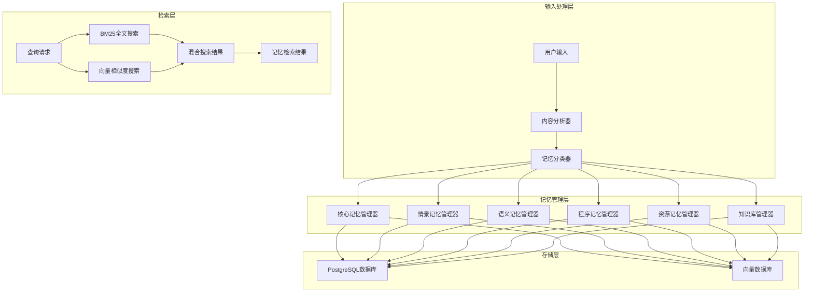

# MIRIX 记忆系统知识文档

## 模块概览

MIRIX记忆系统是项目的核心创新，实现了模拟人类记忆机制的六层记忆架构。系统通过专门化的记忆管理器和智能分类机制，实现了高效的记忆存储、检索和管理功能。

**模块路径**: `mirix/services/` (记忆管理器), `mirix/orm/` (数据模型)  
**核心文件**: `*_memory_manager.py`, `memory.py`, `message.py`  
**版本**: v0.1.4  

---

## 第一层：整体大纲

### 🧠 记忆系统架构概览

#### 六层记忆模型
1. **核心记忆（Core Memory）** - 用户基本信息和代理人格设定
2. **情景记忆（Episodic Memory）** - 时间序列事件和交互历史
3. **语义记忆（Semantic Memory）** - 概念性知识和事实信息
4. **程序记忆（Procedural Memory）** - 操作步骤和技能知识
5. **资源记忆（Resource Memory）** - 工作空间和文件资源
6. **知识库（Knowledge Vault）** - 结构化知识体系

#### 记忆系统架构图


#### 关键特性
- **智能分类**：自动识别输入内容的记忆类型
- **多模态存储**：支持文本、图像、音频等多种数据类型
- **混合检索**：结合BM25全文搜索和向量相似度搜索
- **时间衰减**：模拟人类记忆的时间衰减特性
- **重要性评分**：根据内容重要性调整记忆优先级
- **冲突解决**：处理记忆内容的冲突和更新

---

## 第二层：技术设计支持

### 🏗️ 记忆架构设计原则

#### 设计理念
- **分层存储**：不同类型记忆采用不同的存储策略
- **智能检索**：基于上下文和相关性的智能记忆检索
- **动态管理**：记忆的自动整理、归档和清理
- **隐私保护**：所有记忆数据本地存储，用户完全控制

#### 核心设计模式
1. **策略模式**：不同记忆类型使用不同的存储和检索策略
2. **工厂模式**：动态创建记忆管理器实例
3. **观察者模式**：记忆更新时通知相关组件
4. **装饰器模式**：为记忆操作添加缓存、日志等功能

### 🔧 技术选型依据

#### 存储技术选择
- **PostgreSQL + pgvector**：主要数据存储，支持向量操作
- **Redis**：缓存层，提升检索性能
- **SQLAlchemy ORM**：数据模型和查询抽象
- **Pydantic**：数据验证和序列化

#### 搜索引擎设计
- **BM25算法**：基于词频的全文搜索
- **向量相似度**：基于语义的相似度搜索
- **混合排序**：结合多种搜索结果的排序算法
- **查询优化**：索引优化和查询计划优化

#### 性能优化策略
- **分片存储**：大型记忆的分片存储和管理
- **异步处理**：记忆存储和索引的异步处理
- **缓存机制**：多层缓存提升检索性能
- **批量操作**：批量记忆操作的优化

### 🔗 集成方案设计

#### 与智能体系统集成
- **记忆检索接口**：为智能体提供统一的记忆检索接口
- **记忆更新通知**：记忆更新时通知相关智能体
- **上下文构建**：为智能体构建包含记忆的上下文

#### 与API服务集成
- **RESTful API**：提供记忆管理的REST接口
- **实时通信**：通过SSE推送记忆更新事件
- **批量操作**：支持批量记忆操作的API

---

## 第三层：开发实施指导

### 🚀 核心记忆类型实现

#### 1. 核心记忆（Core Memory）
```python
# 文件位置: mirix/services/core_memory_manager.py
class CoreMemoryManager:
    """
    核心记忆管理器，管理用户基本信息和代理人格设定
    
    功能：
    - 用户个人资料存储
    - 代理人格设定管理
    - 核心信息快速访问
    - 信息一致性维护
    """
    
    def __init__(self, user_id: str):
        self.user_id = user_id
        self.db_session = get_db_session()
        self.logger = get_logger(__name__)
    
    def update_persona(self, persona_content: str) -> bool:
        """
        更新代理人格设定
        
        Args:
            persona_content: 人格设定内容
            
        Returns:
            bool: 更新是否成功
        """
        try:
            # 验证内容长度
            if len(persona_content) > CORE_MEMORY_PERSONA_CHAR_LIMIT:
                raise ValueError("人格设定内容超出长度限制")
            
            # 更新数据库记录
            core_memory = self.db_session.query(CoreMemory).filter_by(
                user_id=self.user_id
            ).first()
            
            if core_memory:
                core_memory.persona = persona_content
                core_memory.updated_at = get_utc_time()
            else:
                core_memory = CoreMemory(
                    user_id=self.user_id,
                    persona=persona_content,
                    created_at=get_utc_time()
                )
                self.db_session.add(core_memory)
            
            self.db_session.commit()
            self.logger.info(f"核心记忆人格设定已更新: {self.user_id}")
            return True
            
        except Exception as e:
            self.db_session.rollback()
            self.logger.error(f"更新人格设定失败: {e}")
            return False
    
    def update_human_info(self, human_content: str) -> bool:
        """
        更新用户基本信息
        
        Args:
            human_content: 用户信息内容
            
        Returns:
            bool: 更新是否成功
        """
        # 实现用户信息更新逻辑
        pass
    
    def get_core_memory(self) -> Dict[str, str]:
        """
        获取完整的核心记忆内容
        
        Returns:
            Dict[str, str]: 包含persona和human的核心记忆
        """
        core_memory = self.db_session.query(CoreMemory).filter_by(
            user_id=self.user_id
        ).first()
        
        if core_memory:
            return {
                "persona": core_memory.persona or DEFAULT_PERSONA,
                "human": core_memory.human or DEFAULT_HUMAN
            }
        else:
            return {
                "persona": DEFAULT_PERSONA,
                "human": DEFAULT_HUMAN
            }
```

#### 2. 情景记忆（Episodic Memory）
```python
# 文件位置: mirix/services/episodic_memory_manager.py
class EpisodicMemoryManager:
    """
    情景记忆管理器，管理时间序列相关的记忆
    
    功能：
    - 事件时间戳记录
    - 时间相关性检索
    - 记忆衰减管理
    - 重要事件标记
    """
    
    def __init__(self, user_id: str):
        self.user_id = user_id
        self.db_session = get_db_session()
        self.embedding_model = embedding_model
        self.logger = get_logger(__name__)
    
    def store_episode(self, content: str, timestamp: datetime = None, 
                     importance: float = 1.0, metadata: Dict = None) -> str:
        """
        存储情景记忆
        
        Args:
            content: 记忆内容
            timestamp: 时间戳，默认为当前时间
            importance: 重要性评分 (0.0-1.0)
            metadata: 附加元数据
            
        Returns:
            str: 记忆ID
        """
        try:
            if timestamp is None:
                timestamp = get_utc_time()
            
            # 生成向量嵌入
            embedding = self.embedding_model.get_embedding(content)
            
            # 创建情景记忆记录
            episode = EpisodicMemory(
                id=str(uuid.uuid4()),
                user_id=self.user_id,
                content=content,
                timestamp=timestamp,
                importance=importance,
                embedding=embedding,
                metadata=metadata or {},
                created_at=get_utc_time()
            )
            
            self.db_session.add(episode)
            self.db_session.commit()
            
            self.logger.info(f"情景记忆已存储: {episode.id}")
            return episode.id
            
        except Exception as e:
            self.db_session.rollback()
            self.logger.error(f"存储情景记忆失败: {e}")
            raise
    
    def retrieve_by_timerange(self, start_time: datetime, end_time: datetime, 
                            limit: int = 10) -> List[EpisodicMemory]:
        """
        按时间范围检索记忆
        
        Args:
            start_time: 开始时间
            end_time: 结束时间
            limit: 返回数量限制
            
        Returns:
            List[EpisodicMemory]: 记忆列表
        """
        episodes = self.db_session.query(EpisodicMemory).filter(
            EpisodicMemory.user_id == self.user_id,
            EpisodicMemory.timestamp >= start_time,
            EpisodicMemory.timestamp <= end_time
        ).order_by(
            EpisodicMemory.importance.desc(),
            EpisodicMemory.timestamp.desc()
        ).limit(limit).all()
        
        return episodes
    
    def retrieve_by_similarity(self, query: str, threshold: float = 0.7, 
                             limit: int = 10) -> List[EpisodicMemory]:
        """
        基于语义相似度检索记忆
        
        Args:
            query: 查询内容
            threshold: 相似度阈值
            limit: 返回数量限制
            
        Returns:
            List[EpisodicMemory]: 相似记忆列表
        """
        # 生成查询向量
        query_embedding = self.embedding_model.get_embedding(query)
        
        # 使用pgvector进行相似度搜索
        episodes = self.db_session.query(EpisodicMemory).filter(
            EpisodicMemory.user_id == self.user_id,
            EpisodicMemory.embedding.cosine_distance(query_embedding) < (1 - threshold)
        ).order_by(
            EpisodicMemory.embedding.cosine_distance(query_embedding)
        ).limit(limit).all()
        
        return episodes
    
    def apply_decay(self, decay_factor: float = 0.95):
        """
        应用时间衰减到记忆重要性
        
        Args:
            decay_factor: 衰减因子 (0.0-1.0)
        """
        current_time = get_utc_time()
        
        episodes = self.db_session.query(EpisodicMemory).filter_by(
            user_id=self.user_id
        ).all()
        
        for episode in episodes:
            # 计算时间差（天数）
            time_diff = (current_time - episode.timestamp).days
            
            # 应用指数衰减
            new_importance = episode.importance * (decay_factor ** time_diff)
            episode.importance = max(new_importance, 0.01)  # 最小重要性
        
        self.db_session.commit()
        self.logger.info(f"已对 {len(episodes)} 条情景记忆应用时间衰减")
```

#### 3. 语义记忆（Semantic Memory）
```python
# 文件位置: mirix/services/semantic_memory_manager.py
class SemanticMemoryManager:
    """
    语义记忆管理器，管理概念性知识和事实信息
    
    功能：
    - 概念关系建模
    - 语义相似度检索
    - 知识图谱构建
    - 事实验证和更新
    """
    
    def __init__(self, user_id: str):
        self.user_id = user_id
        self.db_session = get_db_session()
        self.embedding_model = embedding_model
        self.logger = get_logger(__name__)
    
    def store_concept(self, concept: str, description: str, 
                     category: str = None, relations: List[str] = None) -> str:
        """
        存储概念记忆
        
        Args:
            concept: 概念名称
            description: 概念描述
            category: 概念分类
            relations: 相关概念列表
            
        Returns:
            str: 概念ID
        """
        try:
            # 生成向量嵌入
            full_content = f"{concept}: {description}"
            embedding = self.embedding_model.get_embedding(full_content)
            
            # 创建语义记忆记录
            semantic_memory = SemanticMemory(
                id=str(uuid.uuid4()),
                user_id=self.user_id,
                concept=concept,
                description=description,
                category=category,
                embedding=embedding,
                relations=relations or [],
                created_at=get_utc_time()
            )
            
            self.db_session.add(semantic_memory)
            self.db_session.commit()
            
            self.logger.info(f"语义记忆已存储: {semantic_memory.id}")
            return semantic_memory.id
            
        except Exception as e:
            self.db_session.rollback()
            self.logger.error(f"存储语义记忆失败: {e}")
            raise
    
    def retrieve_by_concept(self, concept: str) -> List[SemanticMemory]:
        """
        按概念名称检索记忆
        
        Args:
            concept: 概念名称
            
        Returns:
            List[SemanticMemory]: 相关记忆列表
        """
        memories = self.db_session.query(SemanticMemory).filter(
            SemanticMemory.user_id == self.user_id,
            SemanticMemory.concept.ilike(f"%{concept}%")
        ).all()
        
        return memories
    
    def build_knowledge_graph(self) -> Dict:
        """
        构建知识图谱
        
        Returns:
            Dict: 知识图谱数据结构
        """
        memories = self.db_session.query(SemanticMemory).filter_by(
            user_id=self.user_id
        ).all()
        
        # 构建节点和边
        nodes = []
        edges = []
        
        for memory in memories:
            # 添加概念节点
            nodes.append({
                "id": memory.id,
                "label": memory.concept,
                "description": memory.description,
                "category": memory.category
            })
            
            # 添加关系边
            for relation in memory.relations:
                related_memory = self.db_session.query(SemanticMemory).filter(
                    SemanticMemory.user_id == self.user_id,
                    SemanticMemory.concept == relation
                ).first()
                
                if related_memory:
                    edges.append({
                        "source": memory.id,
                        "target": related_memory.id,
                        "type": "related"
                    })
        
        return {
            "nodes": nodes,
            "edges": edges
        }
```

### 🔧 记忆检索和搜索实现

#### 混合搜索引擎
```python
# 文件位置: mirix/services/memory_search_engine.py
class MemorySearchEngine:
    """
    记忆搜索引擎，实现BM25和向量相似度的混合搜索
    
    功能：
    - BM25全文搜索
    - 向量相似度搜索
    - 混合搜索结果排序
    - 搜索结果优化
    """
    
    def __init__(self, user_id: str):
        self.user_id = user_id
        self.db_session = get_db_session()
        self.embedding_model = embedding_model
        self.bm25_weight = 0.3
        self.vector_weight = 0.7
    
    def hybrid_search(self, query: str, memory_types: List[str] = None, 
                     limit: int = 10) -> List[Dict]:
        """
        混合搜索记忆
        
        Args:
            query: 搜索查询
            memory_types: 记忆类型过滤
            limit: 返回数量限制
            
        Returns:
            List[Dict]: 搜索结果列表
        """
        # BM25全文搜索
        bm25_results = self._bm25_search(query, memory_types, limit * 2)
        
        # 向量相似度搜索
        vector_results = self._vector_search(query, memory_types, limit * 2)
        
        # 合并和排序结果
        combined_results = self._combine_results(bm25_results, vector_results)
        
        # 返回前N个结果
        return combined_results[:limit]
    
    def _bm25_search(self, query: str, memory_types: List[str], 
                    limit: int) -> List[Dict]:
        """
        BM25全文搜索
        
        Args:
            query: 搜索查询
            memory_types: 记忆类型过滤
            limit: 返回数量限制
            
        Returns:
            List[Dict]: BM25搜索结果
        """
        # 使用PostgreSQL的全文搜索功能
        sql_query = """
        SELECT id, content, memory_type, 
               ts_rank(to_tsvector('english', content), plainto_tsquery(%s)) as bm25_score
        FROM memories 
        WHERE user_id = %s 
        AND to_tsvector('english', content) @@ plainto_tsquery(%s)
        """
        
        params = [query, self.user_id, query]
        
        if memory_types:
            sql_query += " AND memory_type = ANY(%s)"
            params.append(memory_types)
        
        sql_query += " ORDER BY bm25_score DESC LIMIT %s"
        params.append(limit)
        
        result = self.db_session.execute(sql_query, params)
        
        return [
            {
                "id": row.id,
                "content": row.content,
                "memory_type": row.memory_type,
                "bm25_score": float(row.bm25_score),
                "vector_score": 0.0
            }
            for row in result
        ]
    
    def _vector_search(self, query: str, memory_types: List[str], 
                      limit: int) -> List[Dict]:
        """
        向量相似度搜索
        
        Args:
            query: 搜索查询
            memory_types: 记忆类型过滤
            limit: 返回数量限制
            
        Returns:
            List[Dict]: 向量搜索结果
        """
        # 生成查询向量
        query_embedding = self.embedding_model.get_embedding(query)
        
        # 使用pgvector进行相似度搜索
        sql_query = """
        SELECT id, content, memory_type,
               1 - (embedding <=> %s) as vector_score
        FROM memories 
        WHERE user_id = %s
        """
        
        params = [query_embedding, self.user_id]
        
        if memory_types:
            sql_query += " AND memory_type = ANY(%s)"
            params.append(memory_types)
        
        sql_query += " ORDER BY embedding <=> %s LIMIT %s"
        params.extend([query_embedding, limit])
        
        result = self.db_session.execute(sql_query, params)
        
        return [
            {
                "id": row.id,
                "content": row.content,
                "memory_type": row.memory_type,
                "bm25_score": 0.0,
                "vector_score": float(row.vector_score)
            }
            for row in result
        ]
    
    def _combine_results(self, bm25_results: List[Dict], 
                        vector_results: List[Dict]) -> List[Dict]:
        """
        合并BM25和向量搜索结果
        
        Args:
            bm25_results: BM25搜索结果
            vector_results: 向量搜索结果
            
        Returns:
            List[Dict]: 合并后的搜索结果
        """
        # 创建结果字典，以ID为键
        combined = {}
        
        # 添加BM25结果
        for result in bm25_results:
            combined[result["id"]] = result
        
        # 合并向量结果
        for result in vector_results:
            if result["id"] in combined:
                combined[result["id"]]["vector_score"] = result["vector_score"]
            else:
                combined[result["id"]] = result
        
        # 计算混合评分并排序
        for result in combined.values():
            result["hybrid_score"] = (
                self.bm25_weight * result["bm25_score"] + 
                self.vector_weight * result["vector_score"]
            )
        
        # 按混合评分排序
        sorted_results = sorted(
            combined.values(), 
            key=lambda x: x["hybrid_score"], 
            reverse=True
        )
        
        return sorted_results
```

### 🔍 配置和使用示例

#### 记忆系统配置
```yaml
# 文件位置: mirix/configs/memory_config.yaml
memory_system:
  # 核心记忆配置
  core_memory:
    persona_char_limit: 2000
    human_char_limit: 2000
    
  # 情景记忆配置
  episodic_memory:
    max_entries: 10000
    decay_factor: 0.95
    decay_interval_days: 7
    importance_threshold: 0.1
    
  # 语义记忆配置
  semantic_memory:
    max_entries: 5000
    similarity_threshold: 0.7
    enable_knowledge_graph: true
    
  # 程序记忆配置
  procedural_memory:
    max_procedures: 1000
    step_limit: 50
    
  # 资源记忆配置
  resource_memory:
    max_file_size: 10485760  # 10MB
    supported_formats: ["txt", "pdf", "docx", "md"]
    
  # 知识库配置
  knowledge_vault:
    max_entries: 2000
    auto_categorize: true
    
  # 搜索配置
  search:
    bm25_weight: 0.3
    vector_weight: 0.7
    max_results: 20
    enable_cache: true
    cache_ttl: 3600  # 1小时
```

#### 使用示例
```python
from mirix.services.episodic_memory_manager import EpisodicMemoryManager
from mirix.services.semantic_memory_manager import SemanticMemoryManager
from mirix.services.memory_search_engine import MemorySearchEngine

# 初始化记忆管理器
user_id = "user_123"
episodic_manager = EpisodicMemoryManager(user_id)
semantic_manager = SemanticMemoryManager(user_id)
search_engine = MemorySearchEngine(user_id)

# 存储情景记忆
episode_id = episodic_manager.store_episode(
    content="今天和朋友一起去看了电影《星际穿越》，非常震撼",
    importance=0.8,
    metadata={"activity": "entertainment", "location": "cinema"}
)

# 存储语义记忆
concept_id = semantic_manager.store_concept(
    concept="星际穿越",
    description="克里斯托弗·诺兰执导的科幻电影，讲述了宇宙探索和时间旅行的故事",
    category="电影",
    relations=["科幻电影", "克里斯托弗·诺兰", "太空探索"]
)

# 混合搜索记忆
search_results = search_engine.hybrid_search(
    query="星际穿越电影",
    memory_types=["episodic", "semantic"],
    limit=5
)

for result in search_results:
    print(f"记忆ID: {result['id']}")
    print(f"内容: {result['content']}")
    print(f"类型: {result['memory_type']}")
    print(f"混合评分: {result['hybrid_score']:.3f}")
    print("---")
```

### 🐛 常见问题和解决方案

#### 问题1：记忆存储性能问题
**现象**：大量记忆存储时性能下降
**原因**：向量嵌入计算和数据库写入的性能瓶颈
**解决方案**：
```python
# 启用批量存储
batch_memories = []
for content in memory_contents:
    batch_memories.append({
        "content": content,
        "timestamp": get_utc_time(),
        "importance": 1.0
    })

# 批量存储记忆
episodic_manager.batch_store_episodes(batch_memories)

# 异步向量嵌入
import asyncio
async def async_store_episode(content):
    return await episodic_manager.async_store_episode(content)

# 并发处理
tasks = [async_store_episode(content) for content in contents]
results = await asyncio.gather(*tasks)
```

#### 问题2：记忆检索准确性问题
**现象**：搜索结果不够准确或相关性低
**原因**：搜索权重配置不当或阈值设置问题
**解决方案**：
```python
# 调整搜索权重
search_engine.bm25_weight = 0.4
search_engine.vector_weight = 0.6

# 调整相似度阈值
semantic_manager.similarity_threshold = 0.8

# 启用查询扩展
expanded_query = search_engine.expand_query(original_query)
results = search_engine.hybrid_search(expanded_query)
```

#### 问题3：记忆数据一致性问题
**现象**：记忆内容出现冲突或重复
**原因**：并发更新或重复存储导致的数据不一致
**解决方案**：
```python
# 启用事务处理
with episodic_manager.db_session.begin():
    # 检查重复记忆
    existing = episodic_manager.find_similar_episodes(content, threshold=0.9)
    if not existing:
        episodic_manager.store_episode(content)
    else:
        # 更新现有记忆
        episodic_manager.update_episode(existing[0].id, content)

# 启用记忆去重
episodic_manager.deduplicate_memories(similarity_threshold=0.95)
```

---

## 📊 性能监控和优化

### 关键性能指标
- **存储延迟**：记忆存储操作的平均耗时
- **检索延迟**：记忆检索操作的平均耗时
- **存储空间**：各类型记忆占用的存储空间
- **缓存命中率**：记忆缓存的命中率
- **搜索准确率**：搜索结果的相关性评分

### 优化建议
1. **索引优化**：为常用查询字段创建合适的索引
2. **分区存储**：按时间或用户对记忆数据进行分区
3. **缓存策略**：实现多层缓存机制
4. **异步处理**：对非关键操作使用异步处理
5. **定期维护**：定期清理过期记忆和优化索引

---

**文档版本**: v0.1.4  
**最后更新**: 2024年12月  
**维护者**: MIRIX开发团队