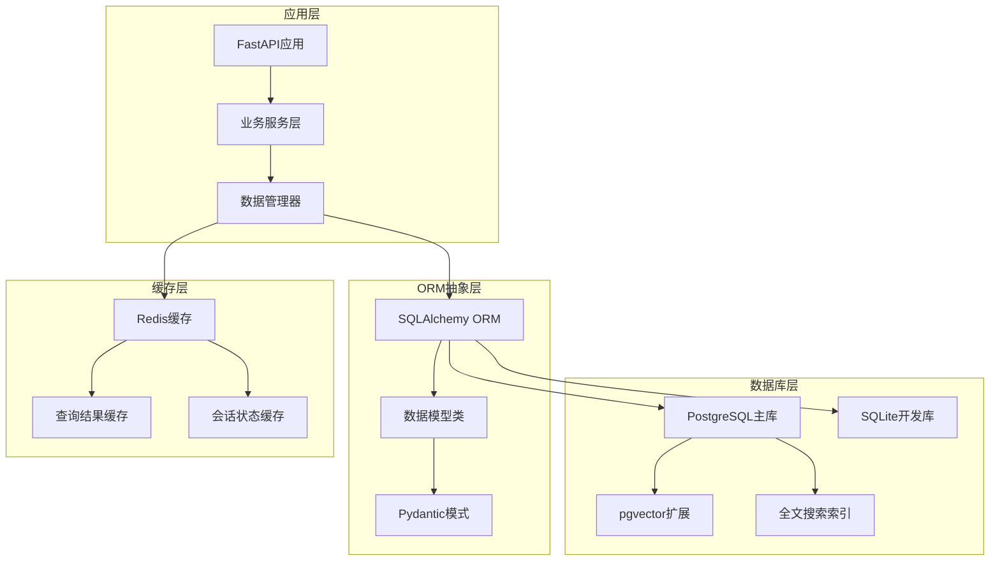
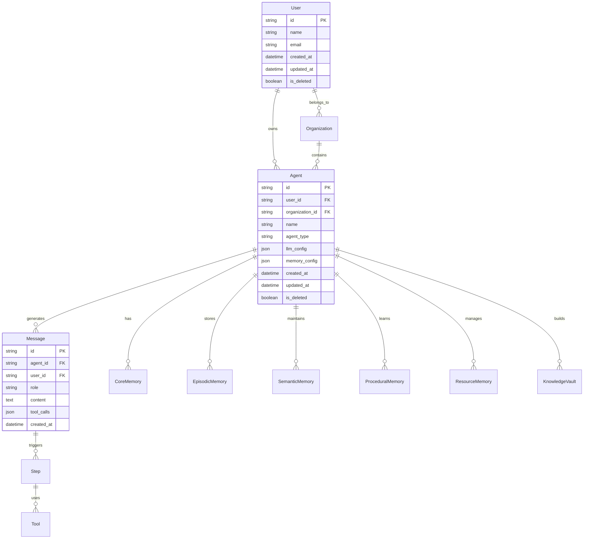
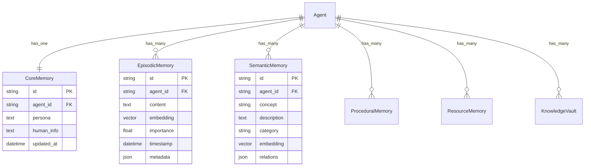

# MIRIX ORM数据层知识文档

## 模块概览

MIRIX ORM数据层是项目的数据访问基础，基于SQLAlchemy ORM框架构建，支持PostgreSQL和SQLite双数据库，实现了完整的数据模型定义、关系映射和数据库操作抽象。

**模块路径**: `mirix/orm/` (数据模型), `mirix/schemas/` (Pydantic模式)  
**核心文件**: `base.py`, `message.py`, `agent.py`, `*_memory.py`  
**版本**: v0.1.4  

---

## 第一层：整体大纲

### 🗄️ ORM架构概览

#### 数据层架构图


#### 核心数据模型
1. **基础模型（Base Models）**
   - `Base`: SQLAlchemy声明基类
   - `CommonSqlalchemyMetaMixins`: 通用元数据混入
   - `SqlalchemyBase`: 项目基础模型类

2. **业务实体模型**
   - `User`: 用户模型
   - `Organization`: 组织模型
   - `Agent`: 智能体模型
   - `Message`: 消息模型

3. **记忆系统模型**
   - `CoreMemory`: 核心记忆模型
   - `EpisodicMemory`: 情景记忆模型
   - `SemanticMemory`: 语义记忆模型
   - `ProceduralMemory`: 程序记忆模型
   - `ResourceMemory`: 资源记忆模型
   - `KnowledgeVault`: 知识库模型

4. **系统支撑模型**
   - `Block`: 记忆块模型
   - `Source`: 数据源模型
   - `Tool`: 工具模型
   - `Step`: 执行步骤模型

#### 关键特性
- **多数据库支持**：PostgreSQL（生产）+ SQLite（开发）
- **向量存储**：集成pgvector扩展支持向量操作
- **全文搜索**：PostgreSQL原生全文搜索功能
- **自动时间戳**：创建和更新时间自动管理
- **软删除**：支持逻辑删除机制
- **关系映射**：完整的外键关系和级联操作
- **数据验证**：Pydantic模式验证和序列化

---

## 第二层：技术设计支持

### 🏗️ ORM设计原则

#### 设计理念
- **单一职责**：每个模型类专注于单一业务实体
- **关系完整性**：通过外键和约束保证数据一致性
- **性能优化**：合理的索引设计和查询优化
- **扩展性**：支持新模型的快速添加和现有模型的扩展

#### 核心设计模式
1. **混入模式（Mixin Pattern）**：通用功能的模块化复用
2. **工厂模式（Factory Pattern）**：数据库会话和连接的创建
3. **仓储模式（Repository Pattern）**：数据访问逻辑的封装
4. **装饰器模式（Decorator Pattern）**：事务管理和缓存功能

### 🔧 技术选型依据

#### ORM框架选择
- **SQLAlchemy 2.0+**：成熟的Python ORM框架
- **声明式映射**：使用Declarative Base进行模型定义
- **类型注解**：完整的类型提示支持
- **异步支持**：支持异步数据库操作

#### 数据库技术选择
- **PostgreSQL 16+**：主要生产数据库
  - 支持JSON/JSONB数据类型
  - 内置全文搜索功能
  - pgvector扩展支持向量操作
  - 强大的索引和查询优化
- **SQLite**：开发和测试环境
  - 轻量级，无需额外配置
  - 支持大部分SQL标准功能
  - 便于单元测试和快速开发

#### 数据验证技术
- **Pydantic V2**：数据验证和序列化
- **类型安全**：运行时类型检查
- **自动文档**：API文档自动生成
- **性能优化**：基于Rust的高性能验证

### 🔗 数据模型关系设计

#### 核心实体关系图


#### 记忆系统关系设计


---

## 第三层：开发实施指导

### 🚀 核心数据模型实现

#### 1. 基础模型类定义
```python
# 文件位置: mirix/orm/base.py
from datetime import datetime
from typing import Optional
from sqlalchemy import Boolean, DateTime, String, func, text
from sqlalchemy.orm import DeclarativeBase, Mapped, declarative_mixin, declared_attr, mapped_column

class Base(DeclarativeBase):
    """SQLAlchemy声明基类，所有ORM模型的根基类"""
    pass

@declarative_mixin
class CommonSqlalchemyMetaMixins(Base):
    """
    通用元数据混入类，提供所有模型的基础字段
    
    功能：
    - 自动时间戳管理
    - 软删除支持
    - 用户追踪功能
    - 通用字段定义
    """
    __abstract__ = True

    # 自动时间戳字段
    created_at: Mapped[Optional[datetime]] = mapped_column(
        DateTime(timezone=True), 
        server_default=func.now(),
        doc="记录创建时间"
    )
    updated_at: Mapped[Optional[datetime]] = mapped_column(
        DateTime(timezone=True), 
        server_default=func.now(), 
        server_onupdate=func.now(),
        doc="记录更新时间"
    )
    
    # 软删除字段
    is_deleted: Mapped[bool] = mapped_column(
        Boolean, 
        server_default=text("FALSE"),
        doc="逻辑删除标记"
    )

    def set_updated_at(self, timestamp: Optional[datetime] = None) -> None:
        """
        手动设置更新时间戳
        
        Args:
            timestamp: 指定的时间戳，为None时使用当前UTC时间
        """
        self.updated_at = timestamp or datetime.utcnow()

    def _set_created_and_updated_by_fields(self, actor_id: str) -> None:
        """
        设置创建者和更新者字段
        
        Args:
            actor_id: 操作者用户ID
        """
        if not self.created_by_id:
            self.created_by_id = actor_id
        self.last_updated_by_id = actor_id

    @declared_attr
    def _created_by_id(cls):
        """创建者ID字段声明"""
        return cls._user_by_id()

    @declared_attr
    def _last_updated_by_id(cls):
        """最后更新者ID字段声明"""
        return cls._user_by_id()

    @classmethod
    def _user_by_id(cls):
        """
        用户ID字段定义，支持灵活的用户关联
        不使用外键约束，允许用户的添加和删除
        """
        return mapped_column(String, nullable=True)

    @property
    def last_updated_by_id(self) -> Optional[str]:
        """获取最后更新者ID"""
        return self._user_id_getter("last_updated")

    @last_updated_by_id.setter
    def last_updated_by_id(self, value: str) -> None:
        """设置最后更新者ID"""
        self._user_id_setter("last_updated", value)

    @property
    def created_by_id(self) -> Optional[str]:
        """获取创建者ID"""
        return self._user_id_getter("created")

    @created_by_id.setter
    def created_by_id(self, value: str) -> None:
        """设置创建者ID"""
        self._user_id_setter("created", value)

    def _user_id_getter(self, prop: str) -> Optional[str]:
        """用户ID获取器"""
        full_prop = f"_{prop}_by_id"
        return getattr(self, full_prop, None)

    def _user_id_setter(self, prop: str, value: str) -> None:
        """用户ID设置器，包含ID格式验证"""
        full_prop = f"_{prop}_by_id"
        if not value:
            setattr(self, full_prop, None)
            return
        
        # 验证用户ID格式
        prefix, id_ = value.split("-", 1)
        assert prefix == "user", f"{prefix} 不是有效的用户ID前缀"
        
        setattr(self, full_prop, value)
```

#### 2. 消息模型实现
```python
# 文件位置: mirix/orm/message.py
from typing import List, Optional
from sqlalchemy import BigInteger, FetchedValue, ForeignKey, Index, event, text
from sqlalchemy.orm import Mapped, Session, mapped_column, relationship, declared_attr

from mirix.orm.custom_columns import MessageContentColumn, ToolCallColumn, ToolReturnColumn
from mirix.orm.mixins import AgentMixin, OrganizationMixin, UserMixin
from mirix.orm.sqlalchemy_base import SqlalchemyBase
from mirix.schemas.mirix_message_content import MessageContent
from mirix.schemas.message import Message as PydanticMessage, ToolReturn
from mirix.schemas.openai.openai import ToolCall as OpenAIToolCall

class Message(SqlalchemyBase, OrganizationMixin, UserMixin, AgentMixin):
    """
    消息数据模型，存储智能体和用户之间的对话消息
    
    功能：
    - 多角色消息支持（用户、助手、系统、工具）
    - 工具调用和返回结果存储
    - 多模态内容支持
    - 消息关系和分组管理
    """
    
    __tablename__ = "messages"
    __table_args__ = (
        # 优化查询性能的复合索引
        Index("ix_messages_agent_created_at", "agent_id", "created_at"),
        Index("ix_messages_created_at", "created_at", "id"),
    )
    __pydantic_model__ = PydanticMessage

    # 主键和基础字段
    id: Mapped[str] = mapped_column(
        primary_key=True, 
        doc="唯一消息标识符"
    )
    role: Mapped[str] = mapped_column(
        doc="消息角色：user/assistant/system/tool"
    )
    
    # 消息内容字段
    text: Mapped[Optional[str]] = mapped_column(
        nullable=True, 
        doc="消息文本内容（兼容性字段）"
    )
    content: Mapped[List[MessageContent]] = mapped_column(
        MessageContentColumn, 
        nullable=True, 
        doc="多模态消息内容部分"
    )
    
    # LLM相关字段
    model: Mapped[Optional[str]] = mapped_column(
        nullable=True, 
        doc="使用的LLM模型"
    )
    name: Mapped[Optional[str]] = mapped_column(
        nullable=True, 
        doc="多智能体场景中的名称"
    )
    
    # 工具调用相关字段
    tool_calls: Mapped[List[OpenAIToolCall]] = mapped_column(
        ToolCallColumn, 
        doc="工具调用信息"
    )
    tool_call_id: Mapped[Optional[str]] = mapped_column(
        nullable=True, 
        doc="工具调用ID"
    )
    tool_returns: Mapped[List[ToolReturn]] = mapped_column(
        ToolReturnColumn, 
        nullable=True, 
        doc="工具执行返回信息"
    )
    
    # 关联和分组字段
    step_id: Mapped[Optional[str]] = mapped_column(
        ForeignKey("steps.id", ondelete="SET NULL"), 
        nullable=True, 
        doc="所属执行步骤ID"
    )
    otid: Mapped[Optional[str]] = mapped_column(
        nullable=True, 
        doc="离线线程ID"
    )
    group_id: Mapped[Optional[str]] = mapped_column(
        nullable=True, 
        doc="多智能体组ID"
    )
    sender_id: Mapped[Optional[str]] = mapped_column(
        nullable=True, 
        doc="发送者ID（身份ID或智能体ID）"
    )

    # 关系映射
    agent: Mapped["Agent"] = relationship(
        "Agent", 
        back_populates="messages", 
        lazy="selectin"
    )
    organization: Mapped["Organization"] = relationship(
        "Organization", 
        back_populates="messages", 
        lazy="selectin"
    )
    step: Mapped["Step"] = relationship(
        "Step", 
        back_populates="messages", 
        lazy="selectin"
    )
    
    @declared_attr
    def user(cls) -> Mapped["User"]:
        """用户关系映射"""
        return relationship("User", lazy="selectin")

    def to_pydantic(self) -> PydanticMessage:
        """
        转换为Pydantic模型，处理兼容性数据
        
        Returns:
            PydanticMessage: 验证后的消息模型
        """
        model = self.__pydantic_model__.model_validate(self)
        
        # 处理遗留文本字段
        if self.text and not model.content:
            from mirix.schemas.mirix_message_content import TextContent
            model.content = [TextContent(text=self.text)]
        
        # 处理空工具调用
        if len(self.tool_calls) == 0:
            model.tool_calls = None
            
        return model
```

#### 3. 智能体模型实现
```python
# 文件位置: mirix/orm/agent.py
from typing import List, Optional, Dict, Any
from sqlalchemy import String, Text, JSON, Enum as SQLEnum
from sqlalchemy.orm import Mapped, mapped_column, relationship

from mirix.orm.sqlalchemy_base import SqlalchemyBase
from mirix.orm.mixins import OrganizationMixin, UserMixin
from mirix.schemas.agent import AgentState, AgentType
from mirix.schemas.llm_config import LLMConfig

class Agent(SqlalchemyBase, OrganizationMixin, UserMixin):
    """
    智能体数据模型，存储智能体的配置和状态信息
    
    功能：
    - 智能体基本信息管理
    - LLM配置存储
    - 记忆配置管理
    - 工具和权限配置
    """
    
    __tablename__ = "agents"
    __pydantic_model__ = AgentState

    # 基础标识字段
    id: Mapped[str] = mapped_column(
        String, 
        primary_key=True, 
        doc="智能体唯一标识符"
    )
    name: Mapped[str] = mapped_column(
        String(255), 
        nullable=False, 
        doc="智能体名称"
    )
    
    # 智能体类型和描述
    agent_type: Mapped[AgentType] = mapped_column(
        SQLEnum(AgentType), 
        nullable=False, 
        doc="智能体类型"
    )
    description: Mapped[Optional[str]] = mapped_column(
        Text, 
        nullable=True, 
        doc="智能体描述"
    )
    
    # 配置信息（JSON存储）
    llm_config: Mapped[Dict[str, Any]] = mapped_column(
        JSON, 
        nullable=False, 
        doc="LLM配置信息"
    )
    memory_config: Mapped[Dict[str, Any]] = mapped_column(
        JSON, 
        nullable=True, 
        doc="记忆系统配置"
    )
    tool_config: Mapped[Dict[str, Any]] = mapped_column(
        JSON, 
        nullable=True, 
        doc="工具配置信息"
    )
    
    # 系统提示词和人格设定
    system_prompt: Mapped[Optional[str]] = mapped_column(
        Text, 
        nullable=True, 
        doc="系统提示词"
    )
    persona: Mapped[Optional[str]] = mapped_column(
        Text, 
        nullable=True, 
        doc="智能体人格设定"
    )
    
    # 状态和权限字段
    is_active: Mapped[bool] = mapped_column(
        default=True, 
        doc="智能体是否激活"
    )
    max_context_length: Mapped[Optional[int]] = mapped_column(
        nullable=True, 
        doc="最大上下文长度"
    )
    
    # 关系映射
    messages: Mapped[List["Message"]] = relationship(
        "Message", 
        back_populates="agent", 
        cascade="all, delete-orphan"
    )
    core_memory: Mapped[Optional["CoreMemory"]] = relationship(
        "CoreMemory", 
        back_populates="agent", 
        uselist=False
    )
    episodic_memories: Mapped[List["EpisodicMemory"]] = relationship(
        "EpisodicMemory", 
        back_populates="agent", 
        cascade="all, delete-orphan"
    )
    semantic_memories: Mapped[List["SemanticMemory"]] = relationship(
        "SemanticMemory", 
        back_populates="agent", 
        cascade="all, delete-orphan"
    )

    def get_llm_config(self) -> LLMConfig:
        """
        获取LLM配置对象
        
        Returns:
            LLMConfig: 验证后的LLM配置
        """
        return LLMConfig.model_validate(self.llm_config)

    def update_llm_config(self, config: LLMConfig) -> None:
        """
        更新LLM配置
        
        Args:
            config: 新的LLM配置
        """
        self.llm_config = config.model_dump()
        self.set_updated_at()

    def to_pydantic(self) -> AgentState:
        """
        转换为Pydantic模型
        
        Returns:
            AgentState: 验证后的智能体状态
        """
        return self.__pydantic_model__.model_validate(self)
```

### 🔧 数据库配置和连接管理

#### 数据库配置
```python
# 文件位置: mirix/settings.py
from typing import Optional
from pydantic import BaseSettings, Field

class DatabaseSettings(BaseSettings):
    """
    数据库配置设置
    
    支持PostgreSQL和SQLite双数据库配置
    """
    
    # PostgreSQL配置（生产环境）
    postgres_host: str = Field("localhost", env="POSTGRES_HOST")
    postgres_port: int = Field(5432, env="POSTGRES_PORT")
    postgres_user: str = Field("mirix", env="POSTGRES_USER")
    postgres_password: str = Field("mirix", env="POSTGRES_PASSWORD")
    postgres_db: str = Field("mirix", env="POSTGRES_DB")
    
    # SQLite配置（开发环境）
    sqlite_path: str = Field("mirix.db", env="SQLITE_PATH")
    
    # 数据库类型选择
    database_type: str = Field("postgresql", env="DATABASE_TYPE")
    
    # 连接池配置
    pool_size: int = Field(10, env="DB_POOL_SIZE")
    max_overflow: int = Field(20, env="DB_MAX_OVERFLOW")
    pool_timeout: int = Field(30, env="DB_POOL_TIMEOUT")
    
    # pgvector配置
    enable_vector_extension: bool = Field(True, env="ENABLE_VECTOR_EXTENSION")
    vector_dimension: int = Field(1536, env="VECTOR_DIMENSION")

    @property
    def database_url(self) -> str:
        """
        构建数据库连接URL
        
        Returns:
            str: 数据库连接字符串
        """
        if self.database_type == "postgresql":
            return (
                f"postgresql://{self.postgres_user}:{self.postgres_password}"
                f"@{self.postgres_host}:{self.postgres_port}/{self.postgres_db}"
            )
        elif self.database_type == "sqlite":
            return f"sqlite:///{self.sqlite_path}"
        else:
            raise ValueError(f"不支持的数据库类型: {self.database_type}")

# 全局配置实例
db_settings = DatabaseSettings()
```

#### 数据库会话管理
```python
# 文件位置: mirix/orm/database.py
from contextlib import contextmanager
from typing import Generator
from sqlalchemy import create_engine, event
from sqlalchemy.orm import sessionmaker, Session
from sqlalchemy.pool import StaticPool

from mirix.settings import db_settings
from mirix.orm.base import Base

class DatabaseManager:
    """
    数据库管理器，负责数据库连接和会话管理
    
    功能：
    - 数据库引擎创建和配置
    - 会话工厂管理
    - 连接池配置
    - 数据库初始化
    """
    
    def __init__(self):
        self.engine = self._create_engine()
        self.SessionLocal = sessionmaker(
            autocommit=False,
            autoflush=False,
            bind=self.engine
        )
    
    def _create_engine(self):
        """
        创建数据库引擎
        
        Returns:
            Engine: SQLAlchemy数据库引擎
        """
        engine_kwargs = {
            "echo": False,  # 生产环境关闭SQL日志
            "future": True,  # 使用SQLAlchemy 2.0风格
        }
        
        if db_settings.database_type == "postgresql":
            engine_kwargs.update({
                "pool_size": db_settings.pool_size,
                "max_overflow": db_settings.max_overflow,
                "pool_timeout": db_settings.pool_timeout,
                "pool_pre_ping": True,  # 连接健康检查
            })
        elif db_settings.database_type == "sqlite":
            engine_kwargs.update({
                "poolclass": StaticPool,
                "connect_args": {
                    "check_same_thread": False,
                    "timeout": 30
                }
            })
        
        engine = create_engine(db_settings.database_url, **engine_kwargs)
        
        # 为PostgreSQL启用pgvector扩展
        if db_settings.database_type == "postgresql" and db_settings.enable_vector_extension:
            @event.listens_for(engine, "connect")
            def enable_pgvector(dbapi_connection, connection_record):
                with dbapi_connection.cursor() as cursor:
                    cursor.execute("CREATE EXTENSION IF NOT EXISTS vector")
        
        return engine
    
    def create_tables(self):
        """创建所有数据表"""
        Base.metadata.create_all(bind=self.engine)
    
    def drop_tables(self):
        """删除所有数据表（谨慎使用）"""
        Base.metadata.drop_all(bind=self.engine)
    
    @contextmanager
    def get_session(self) -> Generator[Session, None, None]:
        """
        获取数据库会话上下文管理器
        
        Yields:
            Session: SQLAlchemy会话对象
        """
        session = self.SessionLocal()
        try:
            yield session
            session.commit()
        except Exception:
            session.rollback()
            raise
        finally:
            session.close()

# 全局数据库管理器实例
db_manager = DatabaseManager()

# 便捷函数
def get_db_session() -> Session:
    """获取数据库会话"""
    return db_manager.SessionLocal()

@contextmanager
def db_session_context():
    """数据库会话上下文管理器"""
    with db_manager.get_session() as session:
        yield session
```

### 🔍 自定义列类型实现

#### 向量列类型
```python
# 文件位置: mirix/orm/custom_columns.py
from typing import Any, List, Optional
from sqlalchemy import TypeDecorator, Text, JSON
from sqlalchemy.dialects.postgresql import ARRAY
import json
import numpy as np

class VectorColumn(TypeDecorator):
    """
    向量列类型，支持PostgreSQL pgvector和SQLite JSON存储
    
    功能：
    - PostgreSQL使用原生vector类型
    - SQLite使用JSON序列化存储
    - 自动类型转换和验证
    """
    
    impl = Text
    cache_ok = True
    
    def load_dialect_impl(self, dialect):
        """根据数据库方言选择实现类型"""
        if dialect.name == 'postgresql':
            from pgvector.sqlalchemy import Vector
            return dialect.type_descriptor(Vector(1536))  # 默认1536维
        else:
            return dialect.type_descriptor(Text())
    
    def process_bind_param(self, value: Optional[List[float]], dialect) -> Optional[str]:
        """处理绑定参数（Python -> 数据库）"""
        if value is None:
            return None
        
        if dialect.name == 'postgresql':
            return value  # pgvector直接处理
        else:
            return json.dumps(value)  # SQLite使用JSON
    
    def process_result_value(self, value: Optional[str], dialect) -> Optional[List[float]]:
        """处理结果值（数据库 -> Python）"""
        if value is None:
            return None
        
        if dialect.name == 'postgresql':
            return value  # pgvector直接返回
        else:
            return json.loads(value)  # SQLite解析JSON

class MessageContentColumn(TypeDecorator):
    """
    消息内容列类型，支持多模态内容存储
    
    功能：
    - JSON序列化存储
    - Pydantic模型验证
    - 类型安全转换
    """
    
    impl = JSON
    cache_ok = True
    
    def process_bind_param(self, value: Optional[List], dialect) -> Optional[dict]:
        """处理绑定参数"""
        if value is None:
            return None
        
        # 转换Pydantic模型为字典
        if hasattr(value[0], 'model_dump'):
            return [item.model_dump() for item in value]
        return value
    
    def process_result_value(self, value: Optional[dict], dialect) -> Optional[List]:
        """处理结果值"""
        if value is None:
            return None
        
        # 转换字典为Pydantic模型
        from mirix.schemas.mirix_message_content import MessageContent
        return [MessageContent.model_validate(item) for item in value]

class ToolCallColumn(TypeDecorator):
    """
    工具调用列类型，存储OpenAI格式的工具调用信息
    """
    
    impl = JSON
    cache_ok = True
    
    def process_bind_param(self, value: Optional[List], dialect) -> Optional[List[dict]]:
        """处理绑定参数"""
        if value is None:
            return []
        
        if hasattr(value[0], 'model_dump'):
            return [item.model_dump() for item in value]
        return value
    
    def process_result_value(self, value: Optional[List[dict]], dialect) -> Optional[List]:
        """处理结果值"""
        if not value:
            return []
        
        from mirix.schemas.openai.openai import ToolCall
        return [ToolCall.model_validate(item) for item in value]
```

### 🔍 使用示例和最佳实践

#### 基础CRUD操作
```python
from mirix.orm.database import db_session_context
from mirix.orm.message import Message
from mirix.orm.agent import Agent
from mirix.schemas.message import MessageCreate, MessageRole

# 创建消息
def create_message(agent_id: str, content: str, role: MessageRole) -> Message:
    """
    创建新消息记录
    
    Args:
        agent_id: 智能体ID
        content: 消息内容
        role: 消息角色
        
    Returns:
        Message: 创建的消息对象
    """
    with db_session_context() as session:
        message = Message(
            id=f"msg-{uuid.uuid4()}",
            agent_id=agent_id,
            role=role.value,
            text=content,
            created_at=get_utc_time()
        )
        session.add(message)
        session.flush()  # 获取生成的ID
        return message

# 查询消息
def get_agent_messages(agent_id: str, limit: int = 50) -> List[Message]:
    """
    获取智能体的消息历史
    
    Args:
        agent_id: 智能体ID
        limit: 返回数量限制
        
    Returns:
        List[Message]: 消息列表
    """
    with db_session_context() as session:
        messages = session.query(Message).filter(
            Message.agent_id == agent_id,
            Message.is_deleted == False
        ).order_by(
            Message.created_at.desc()
        ).limit(limit).all()
        
        return messages

# 更新消息
def update_message_content(message_id: str, new_content: str) -> bool:
    """
    更新消息内容
    
    Args:
        message_id: 消息ID
        new_content: 新内容
        
    Returns:
        bool: 更新是否成功
    """
    with db_session_context() as session:
        message = session.query(Message).filter(
            Message.id == message_id
        ).first()
        
        if message:
            message.text = new_content
            message.set_updated_at()
            return True
        return False

# 软删除消息
def delete_message(message_id: str) -> bool:
    """
    软删除消息
    
    Args:
        message_id: 消息ID
        
    Returns:
        bool: 删除是否成功
    """
    with db_session_context() as session:
        message = session.query(Message).filter(
            Message.id == message_id
        ).first()
        
        if message:
            message.is_deleted = True
            message.set_updated_at()
            return True
        return False
```

#### 复杂查询示例
```python
from sqlalchemy import and_, or_, func, desc
from sqlalchemy.orm import joinedload

def search_messages_with_filters(
    user_id: str,
    keyword: Optional[str] = None,
    agent_ids: Optional[List[str]] = None,
    start_date: Optional[datetime] = None,
    end_date: Optional[datetime] = None,
    roles: Optional[List[MessageRole]] = None,
    limit: int = 20
) -> List[Message]:
    """
    复杂条件消息搜索
    
    Args:
        user_id: 用户ID
        keyword: 关键词搜索
        agent_ids: 智能体ID列表
        start_date: 开始日期
        end_date: 结束日期
        roles: 消息角色列表
        limit: 返回数量限制
        
    Returns:
        List[Message]: 搜索结果
    """
    with db_session_context() as session:
        query = session.query(Message).options(
            joinedload(Message.agent),  # 预加载关联数据
            joinedload(Message.user)
        ).filter(
            Message.user_id == user_id,
            Message.is_deleted == False
        )
        
        # 关键词搜索
        if keyword:
            query = query.filter(
                or_(
                    Message.text.ilike(f"%{keyword}%"),
                    Message.content.astext.ilike(f"%{keyword}%")
                )
            )
        
        # 智能体过滤
        if agent_ids:
            query = query.filter(Message.agent_id.in_(agent_ids))
        
        # 时间范围过滤
        if start_date:
            query = query.filter(Message.created_at >= start_date)
        if end_date:
            query = query.filter(Message.created_at <= end_date)
        
        # 角色过滤
        if roles:
            role_values = [role.value for role in roles]
            query = query.filter(Message.role.in_(role_values))
        
        # 排序和限制
        messages = query.order_by(
            desc(Message.created_at)
        ).limit(limit).all()
        
        return messages

def get_message_statistics(user_id: str) -> Dict[str, Any]:
    """
    获取用户消息统计信息
    
    Args:
        user_id: 用户ID
        
    Returns:
        Dict[str, Any]: 统计信息
    """
    with db_session_context() as session:
        # 总消息数
        total_messages = session.query(func.count(Message.id)).filter(
            Message.user_id == user_id,
            Message.is_deleted == False
        ).scalar()
        
        # 按角色统计
        role_stats = session.query(
            Message.role,
            func.count(Message.id).label('count')
        ).filter(
            Message.user_id == user_id,
            Message.is_deleted == False
        ).group_by(Message.role).all()
        
        # 按智能体统计
        agent_stats = session.query(
            Agent.name,
            func.count(Message.id).label('count')
        ).join(Message).filter(
            Message.user_id == user_id,
            Message.is_deleted == False
        ).group_by(Agent.name).all()
        
        # 最近活动
        recent_activity = session.query(
            func.date(Message.created_at).label('date'),
            func.count(Message.id).label('count')
        ).filter(
            Message.user_id == user_id,
            Message.is_deleted == False,
            Message.created_at >= datetime.utcnow() - timedelta(days=30)
        ).group_by(
            func.date(Message.created_at)
        ).order_by(desc('date')).all()
        
        return {
            "total_messages": total_messages,
            "role_distribution": {role: count for role, count in role_stats},
            "agent_distribution": {name: count for name, count in agent_stats},
            "recent_activity": [
                {"date": date.isoformat(), "count": count} 
                for date, count in recent_activity
            ]
        }
```

### 🐛 常见问题和解决方案

#### 问题1：数据库连接池耗尽
**现象**：应用程序出现连接超时错误
**原因**：会话未正确关闭或连接池配置不当
**解决方案**：
```python
# 正确的会话管理
def correct_session_usage():
    with db_session_context() as session:
        # 执行数据库操作
        result = session.query(Message).all()
        return result
    # 会话自动关闭

# 调整连接池配置
db_settings.pool_size = 20
db_settings.max_overflow = 30
db_settings.pool_timeout = 60
```

#### 问题2：向量数据类型错误
**现象**：向量数据存储或查询失败
**原因**：向量维度不匹配或数据格式错误
**解决方案**：
```python
# 验证向量数据
def validate_vector_data(embedding: List[float]) -> List[float]:
    if len(embedding) != 1536:
        raise ValueError(f"向量维度错误，期望1536，实际{len(embedding)}")
    
    # 确保数据类型正确
    return [float(x) for x in embedding]

# 安全的向量存储
def store_vector_safely(content: str, embedding: List[float]):
    validated_embedding = validate_vector_data(embedding)
    
    with db_session_context() as session:
        memory = EpisodicMemory(
            content=content,
            embedding=validated_embedding
        )
        session.add(memory)
```

#### 问题3：JSON字段序列化问题
**现象**：复杂对象无法正确存储到JSON字段
**原因**：对象包含不可序列化的数据类型
**解决方案**：
```python
import json
from datetime import datetime
from decimal import Decimal

class CustomJSONEncoder(json.JSONEncoder):
    """自定义JSON编码器"""
    
    def default(self, obj):
        if isinstance(obj, datetime):
            return obj.isoformat()
        elif isinstance(obj, Decimal):
            return float(obj)
        elif hasattr(obj, 'model_dump'):
            return obj.model_dump()
        return super().default(obj)

# 使用自定义编码器
def safe_json_storage(data: Any) -> str:
    return json.dumps(data, cls=CustomJSONEncoder, ensure_ascii=False)
```

---

## 📊 性能监控和优化

### 关键性能指标
- **查询响应时间**：数据库查询的平均响应时间
- **连接池使用率**：数据库连接池的使用情况
- **索引命中率**：查询索引的使用效率
- **事务成功率**：数据库事务的成功率
- **存储空间使用**：各表的存储空间占用

### 优化建议
1. **索引优化**：为常用查询字段创建合适的索引
2. **查询优化**：使用explain分析查询计划
3. **连接池调优**：根据负载调整连接池参数
4. **批量操作**：使用批量插入和更新减少数据库交互
5. **分区策略**：对大表实施分区策略
6. **缓存机制**：实现查询结果缓存

---

**文档版本**: v0.1.4  
**最后更新**: 2024年12月  
**维护者**: MIRIX开发团队