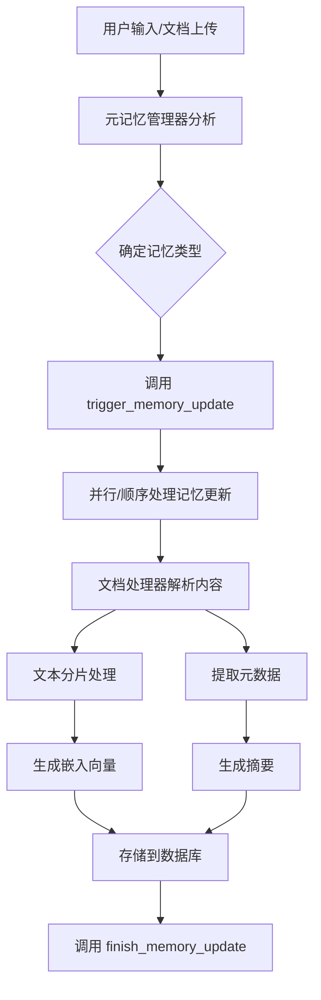

# MIRIX 记忆系统分析文档

## 概述

MIRIX 项目实现了一个多层次的记忆系统，支持6种不同类型的记忆存储和查询。本文档详细分析了记忆系统的存储策略、查询逻辑和实现机制。

## 1. 记忆系统架构

### 1.1 记忆类型

MIRIX 支持以下6种记忆类型：

1. **核心记忆 (Core Memory)** - 用户个人资料和交互偏好
2. **情景记忆 (Episodic Memory)** - 时间相关的事件和活动
3. **程序记忆 (Procedural Memory)** - 步骤说明和工作流程
4. **资源记忆 (Resource Memory)** - 文件、文档和参考资料
5. **知识库记忆 (Knowledge Vault)** - 静态参考数据（联系信息、密码等）
6. **语义记忆 (Semantic Memory)** - 通用知识和概念

### 1.2 核心组件

- **元记忆管理器 (Meta Memory Manager)** - 负责分析输入并决定更新哪些记忆类型
- **记忆管理器 (Memory Managers)** - 每种记忆类型都有专门的管理器
- **文档处理器 (Document Processor)** - 处理文档解析和内容提取
- **嵌入处理器 (Embedding Processor)** - 处理文本分片和向量嵌入

## 2. 记忆存储流程

### 2.1 存储流程图



### 2.2 存储流程详细说明

#### 2.2.1 输入分析阶段
1. **元记忆管理器接收输入** - 可能是文本消息、图片、语音转录或文档
2. **内容分析** - 分析输入内容的类型和特征
3. **记忆类型分类** - 根据内容特征决定需要更新的记忆类型

#### 2.2.2 记忆更新触发
```python
# 触发记忆更新的核心函数
def trigger_memory_update(memory_types: List[str]) -> None:
    # 映射记忆类型到代理类型
    memory_type_to_agent_type = {
        "core": "core_memory_agent",
        "episodic": "episodic_memory_agent", 
        "resource": "resource_memory_agent",
        "procedural": "procedural_memory_agent",
        "knowledge_vault": "knowledge_vault_agent",
        "semantic": "semantic_memory_agent"
    }
    
    # 并行或顺序处理记忆更新
    for memory_type in memory_types:
        agent_type = memory_type_to_agent_type[memory_type]
        # 发送消息给对应的记忆代理
```

#### 2.2.3 文档处理阶段
文档处理器支持多种格式：
- **Markdown (.md)** - 提取标题结构、元数据、HTML内容
- **纯文本 (.txt)** - 分析段落结构、行数统计
- **Excel (.xlsx, .xls)** - 提取工作表数据、转换为文本摘要
- **CSV** - 解析表格数据、生成结构化摘要

## 3. 记忆存储策略

### 3.1 文档解析策略

#### 3.1.1 DocumentProcessor 类实现
```python
class DocumentProcessor:
    SUPPORTED_FORMATS = {
        '.md': 'markdown',
        '.txt': 'text', 
        '.xlsx': 'excel',
        '.csv': 'csv'
    }
    
    def process_document(self, file_path, content=None):
        # 1. 检测文件格式
        # 2. 选择对应的处理方法
        # 3. 提取内容和元数据
        # 4. 生成摘要
```

#### 3.1.2 Markdown 处理
- 使用 `markdown` 库解析内容
- 提取元数据 (Meta)
- 生成目录结构 (TOC)
- 支持表格扩展
- 提取标题层次结构

#### 3.1.3 Excel 处理
- 使用 `pandas` 读取工作表
- 提取每个工作表的数据
- 生成文本摘要
- 保留数据结构信息

### 3.2 文本分片策略

#### 3.2.1 分片实现
```python
def parse_and_chunk_text(text: str, chunk_size: int) -> List[str]:
    from llama_index.core.node_parser import SentenceSplitter
    
    parser = SentenceSplitter(chunk_size=chunk_size)
    llama_index_docs = [LlamaIndexDocument(text=text)]
    nodes = parser.get_nodes_from_documents(llama_index_docs)
    return [n.text for n in nodes]
```

#### 3.2.2 分片策略特点
- **基于句子的分割** - 使用 LlamaIndex 的 SentenceSplitter
- **智能边界检测** - 避免在句子中间分割
- **可配置块大小** - 根据嵌入模型调整
- **上下文保持** - 保持语义连贯性

### 3.3 嵌入处理策略

#### 3.3.1 支持的嵌入模型
- **OpenAI 兼容端点** - 支持标准 OpenAI API
- **Azure OpenAI** - 企业级部署
- **Ollama** - 本地部署模型
- **自定义端点** - 灵活的模型选择

#### 3.3.2 文本预处理
```python
def check_and_split_text(text: str, embedding_model: str) -> List[str]:
    # 1. 获取对应的分词器
    # 2. 计算 token 数量
    # 3. 如果超过限制则截断
    # 4. 应用格式化处理
```

### 3.4 数据库存储策略

#### 3.4.1 存储结构
每种记忆类型都有专门的数据表：
- **episodic_memory** - 情景记忆表
- **procedural_memory** - 程序记忆表  
- **resource_memory** - 资源记忆表
- **knowledge_vault** - 知识库表
- **semantic_memory** - 语义记忆表

#### 3.4.2 索引策略
- **全文搜索索引** - 支持 PostgreSQL FTS5 和 SQLite FTS
- **向量索引** - 存储嵌入向量用于语义搜索
- **时间索引** - 支持时间范围查询
- **用户隔离** - 基于用户ID的数据隔离

## 4. 记忆查询逻辑

### 4.1 查询方法

MIRIX 支持4种主要的查询方法：

#### 4.1.1 BM25 全文搜索 (推荐)
```python
search_method='bm25'
```
- **PostgreSQL** - 使用原生 FTS 和 ts_rank_cd 评分
- **SQLite** - 使用 FTS5 扩展
- **特点** - 快速、高效的关键词搜索
- **适用场景** - 精确关键词匹配

#### 4.1.2 向量相似度搜索
```python
search_method='embedding'
```
- **实现** - 基于嵌入向量的余弦相似度
- **特点** - 语义理解能力强
- **适用场景** - 概念性查询、模糊匹配

#### 4.1.3 字符串匹配
```python
search_method='string_match'
```
- **实现** - 简单的字符串包含检查
- **特点** - 最基础的匹配方式
- **适用场景** - 精确字符串查找

#### 4.1.4 模糊匹配
```python
search_method='fuzzy_match'
```
- **实现** - 基于编辑距离的模糊匹配
- **特点** - 容错能力
- **适用场景** - 处理拼写错误

### 4.2 查询字段

每种记忆类型支持不同的查询字段：

| 记忆类型 | 支持的查询字段 |
|---------|---------------|
| Episodic | summary, details |
| Procedural | summary, steps |
| Resource | summary, content |
| Knowledge Vault | caption, secret_value |
| Semantic | name, summary, details |

### 4.3 查询实现

#### 4.3.1 统一查询接口
```python
def search_in_memory(
    memory_type: str,
    query: str, 
    search_field: str,
    search_method: str,
    limit: int = 10
) -> str:
    # 1. 验证参数
    # 2. 选择对应的记忆管理器
    # 3. 执行查询
    # 4. 格式化结果
```

#### 4.3.2 记忆管理器查询方法
每个记忆管理器都实现了 `list_*` 方法：
- `list_episodic_memory()` - 查询情景记忆
- `list_procedures()` - 查询程序记忆
- `list_resources()` - 查询资源记忆
- `list_knowledge()` - 查询知识库
- `list_semantic_items()` - 查询语义记忆

## 5. 查询案例说明

### 5.1 案例1：资源记忆查询

#### 场景描述
用户上传了一个Python编程教程文档，现在想要查找相关的Python资源。

#### 查询实现
```python
# BM25 全文搜索
results = resource_memory_manager.list_resources(
    agent_state=agent_state,
    actor=user,
    query="Python programming",
    search_method='bm25',
    search_field='content',
    limit=10
)

# 向量语义搜索  
results = resource_memory_manager.list_resources(
    agent_state=agent_state,
    actor=user,
    query="Python programming tutorial",
    search_method='embedding', 
    search_field='summary',
    limit=10
)
```

#### 查询结果
- **BM25搜索** - 返回包含"Python"和"programming"关键词的文档
- **向量搜索** - 返回语义相关的编程教程，即使不包含确切关键词

### 5.2 案例2：情景记忆时间范围查询

#### 场景描述
用户想要查找上周的购物活动记录。

#### 查询实现
```python
# 时间范围查询
results = list_memory_within_timerange(
    memory_type='episodic',
    start_time='2024-01-15T00:00:00Z',
    end_time='2024-01-21T23:59:59Z',
    limit=20
)

# 结合关键词搜索
results = episodic_memory_manager.list_episodic_memory(
    agent_state=agent_state,
    actor=user,
    query="shopping grocery",
    search_method='bm25',
    search_field='summary',
    limit=10
)
```

#### 查询结果
- **时间范围查询** - 返回指定时间段内的所有活动
- **关键词搜索** - 返回包含购物相关关键词的事件

### 5.3 案例3：多字段复合查询

#### 场景描述
在程序记忆中查找机器学习相关的工作流程。

#### 查询实现
```python
# 在摘要字段搜索
summary_results = procedural_memory_manager.list_procedures(
    agent_state=agent_state,
    actor=user,
    query="machine learning",
    search_method='bm25',
    search_field='summary',
    limit=5
)

# 在步骤字段搜索
steps_results = procedural_memory_manager.list_procedures(
    agent_state=agent_state,
    actor=user,
    query="machine learning",
    search_method='bm25', 
    search_field='steps',
    limit=5
)

# 向量语义搜索
semantic_results = procedural_memory_manager.list_procedures(
    agent_state=agent_state,
    actor=user,
    query="AI model training workflow",
    search_method='embedding',
    search_field='summary',
    limit=5
)
```

#### 查询结果对比
- **摘要搜索** - 找到标题或描述中包含"machine learning"的流程
- **步骤搜索** - 找到具体步骤中涉及机器学习的流程  
- **语义搜索** - 找到概念上相关的AI训练流程

## 6. 性能优化

### 6.1 数据库优化
- **索引策略** - 为常用查询字段建立索引
- **分页查询** - 使用 LIMIT 控制结果数量
- **连接池** - 复用数据库连接

### 6.2 搜索优化
- **缓存机制** - 缓存常用查询结果
- **并行处理** - 多记忆类型并行查询
- **预计算** - 预生成常用嵌入向量

### 6.3 存储优化
- **批量操作** - 批量插入和更新
- **压缩存储** - 压缩大文本内容
- **定期清理** - 清理过期或无用数据

## 7. 总结

MIRIX 的记忆系统通过以下特点实现了高效的存储和查询：

1. **多层次架构** - 6种记忆类型满足不同需求
2. **智能分类** - 元记忆管理器自动分类内容
3. **灵活存储** - 支持多种文档格式和处理策略
4. **多样查询** - 4种查询方法适应不同场景
5. **高性能** - 数据库优化和索引策略
6. **可扩展** - 模块化设计便于扩展

这个记忆系统为AI助手提供了强大的知识管理能力，能够有效地存储、组织和检索各种类型的信息。