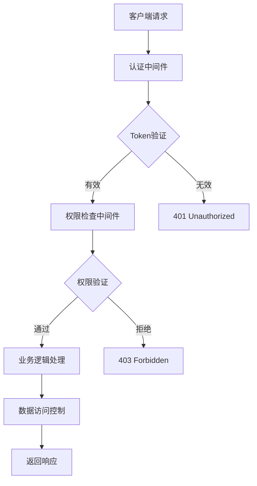

# MIRIX用户隔离优化方案

## 📋 方案概述

本方案旨在为MIRIX后端系统建立完善的用户隔离和安全访问控制机制，确保多用户环境下的数据安全和隐私保护。

## 🎯 优化目标

1. **完善的身份认证**：建立JWT-based的用户认证体系
2. **细粒度权限控制**：实现基于角色的访问控制(RBAC)
3. **严格的数据隔离**：确保用户只能访问自己的数据
4. **安全的API设计**：所有敏感操作都需要认证和授权
5. **审计和监控**：记录所有用户操作，支持安全审计

## 🏗️ 架构设计

### 1. 认证授权架构



### 2. 用户权限模型

```python
class UserRole(str, Enum):
    """用户角色枚举"""
    ADMIN = "admin"           # 系统管理员
    ORG_ADMIN = "org_admin"   # 组织管理员
    USER = "user"             # 普通用户
    GUEST = "guest"           # 访客用户

class Permission(str, Enum):
    """权限枚举"""
    # 用户管理权限
    USER_CREATE = "user:create"
    USER_READ = "user:read"
    USER_UPDATE = "user:update"
    USER_DELETE = "user:delete"
    USER_SWITCH = "user:switch"
    
    # 记忆管理权限
    MEMORY_READ = "memory:read"
    MEMORY_WRITE = "memory:write"
    MEMORY_DELETE = "memory:delete"
    
    # 智能体管理权限
    AGENT_CREATE = "agent:create"
    AGENT_READ = "agent:read"
    AGENT_UPDATE = "agent:update"
    AGENT_DELETE = "agent:delete"
    
    # 组织管理权限
    ORG_READ = "org:read"
    ORG_UPDATE = "org:update"
    ORG_MANAGE_USERS = "org:manage_users"
```

## 🔧 核心组件实现

### 1. JWT认证系统

#### 1.1 JWT Token管理器
```python
from datetime import datetime, timedelta
from typing import Optional, Dict, Any
import jwt
from passlib.context import CryptContext

class JWTManager:
    """JWT令牌管理器"""
    
    def __init__(self, secret_key: str, algorithm: str = "HS256"):
        self.secret_key = secret_key
        self.algorithm = algorithm
        self.pwd_context = CryptContext(schemes=["bcrypt"], deprecated="auto")
    
    def create_access_token(
        self, 
        user_id: str, 
        organization_id: str,
        role: UserRole,
        expires_delta: Optional[timedelta] = None
    ) -> str:
        """创建访问令牌"""
        if expires_delta:
            expire = datetime.utcnow() + expires_delta
        else:
            expire = datetime.utcnow() + timedelta(hours=24)
        
        to_encode = {
            "sub": user_id,
            "org_id": organization_id,
            "role": role.value,
            "exp": expire,
            "iat": datetime.utcnow(),
            "type": "access"
        }
        
        return jwt.encode(to_encode, self.secret_key, algorithm=self.algorithm)
    
    def create_refresh_token(self, user_id: str) -> str:
        """创建刷新令牌"""
        expire = datetime.utcnow() + timedelta(days=30)
        to_encode = {
            "sub": user_id,
            "exp": expire,
            "iat": datetime.utcnow(),
            "type": "refresh"
        }
        
        return jwt.encode(to_encode, self.secret_key, algorithm=self.algorithm)
    
    def verify_token(self, token: str) -> Optional[Dict[str, Any]]:
        """验证令牌"""
        try:
            payload = jwt.decode(token, self.secret_key, algorithms=[self.algorithm])
            return payload
        except jwt.ExpiredSignatureError:
            raise HTTPException(status_code=401, detail="Token已过期")
        except jwt.JWTError:
            raise HTTPException(status_code=401, detail="无效的Token")
    
    def hash_password(self, password: str) -> str:
        """密码哈希"""
        return self.pwd_context.hash(password)
    
    def verify_password(self, plain_password: str, hashed_password: str) -> bool:
        """验证密码"""
        return self.pwd_context.verify(plain_password, hashed_password)
```

#### 1.2 用户认证模型扩展
```python
from sqlalchemy.orm import Mapped, mapped_column
from sqlalchemy import String, DateTime, Boolean
from datetime import datetime

class UserAuth(SqlalchemyBase, OrganizationMixin):
    """用户认证信息表"""
    
    __tablename__ = "user_auth"
    
    user_id: Mapped[str] = mapped_column(String, ForeignKey("users.id"), unique=True)
    username: Mapped[str] = mapped_column(String, unique=True, nullable=False)
    email: Mapped[str] = mapped_column(String, unique=True, nullable=False)
    password_hash: Mapped[str] = mapped_column(String, nullable=False)
    role: Mapped[str] = mapped_column(String, default=UserRole.USER.value)
    is_active: Mapped[bool] = mapped_column(Boolean, default=True)
    last_login: Mapped[Optional[datetime]] = mapped_column(DateTime, nullable=True)
    failed_login_attempts: Mapped[int] = mapped_column(default=0)
    locked_until: Mapped[Optional[datetime]] = mapped_column(DateTime, nullable=True)
    
    # 关系
    user: Mapped["User"] = relationship("User", back_populates="auth")

class UserSession(SqlalchemyBase, UserMixin):
    """用户会话表"""
    
    __tablename__ = "user_sessions"
    
    session_id: Mapped[str] = mapped_column(String, unique=True, nullable=False)
    refresh_token_hash: Mapped[str] = mapped_column(String, nullable=False)
    expires_at: Mapped[datetime] = mapped_column(DateTime, nullable=False)
    is_active: Mapped[bool] = mapped_column(Boolean, default=True)
    ip_address: Mapped[Optional[str]] = mapped_column(String, nullable=True)
    user_agent: Mapped[Optional[str]] = mapped_column(String, nullable=True)
```

### 2. 权限控制系统

#### 2.1 基于角色的权限控制
```python
from typing import List, Set
from enum import Enum

class RolePermissionManager:
    """角色权限管理器"""
    
    # 角色权限映射
    ROLE_PERMISSIONS = {
        UserRole.ADMIN: {
            # 系统管理员拥有所有权限
            Permission.USER_CREATE, Permission.USER_READ, Permission.USER_UPDATE, 
            Permission.USER_DELETE, Permission.USER_SWITCH,
            Permission.MEMORY_READ, Permission.MEMORY_WRITE, Permission.MEMORY_DELETE,
            Permission.AGENT_CREATE, Permission.AGENT_READ, Permission.AGENT_UPDATE, 
            Permission.AGENT_DELETE,
            Permission.ORG_READ, Permission.ORG_UPDATE, Permission.ORG_MANAGE_USERS,
        },
        UserRole.ORG_ADMIN: {
            # 组织管理员权限
            Permission.USER_READ, Permission.USER_UPDATE, Permission.USER_SWITCH,
            Permission.MEMORY_READ, Permission.MEMORY_WRITE,
            Permission.AGENT_CREATE, Permission.AGENT_READ, Permission.AGENT_UPDATE,
            Permission.ORG_READ, Permission.ORG_MANAGE_USERS,
        },
        UserRole.USER: {
            # 普通用户权限
            Permission.USER_READ,
            Permission.MEMORY_READ, Permission.MEMORY_WRITE,
            Permission.AGENT_READ, Permission.AGENT_UPDATE,
        },
        UserRole.GUEST: {
            # 访客权限
            Permission.USER_READ,
            Permission.MEMORY_READ,
            Permission.AGENT_READ,
        }
    }
    
    @classmethod
    def get_role_permissions(cls, role: UserRole) -> Set[Permission]:
        """获取角色权限"""
        return cls.ROLE_PERMISSIONS.get(role, set())
    
    @classmethod
    def has_permission(cls, role: UserRole, permission: Permission) -> bool:
        """检查角色是否有指定权限"""
        return permission in cls.get_role_permissions(role)
    
    @classmethod
    def can_access_user_data(cls, actor_role: UserRole, actor_id: str, target_user_id: str) -> bool:
        """检查是否可以访问其他用户数据"""
        # 管理员可以访问所有用户数据
        if actor_role in [UserRole.ADMIN, UserRole.ORG_ADMIN]:
            return True
        
        # 普通用户只能访问自己的数据
        return actor_id == target_user_id
```

#### 2.2 数据访问控制增强
```python
class EnhancedAccessControl:
    """增强的访问控制"""
    
    @staticmethod
    def apply_user_isolation_predicate(
        query: "Select",
        actor: "UserAuth",
        target_user_id: Optional[str] = None,
        access_type: AccessType = AccessType.USER
    ) -> "Select":
        """应用用户隔离谓词"""
        
        # 检查是否可以访问目标用户数据
        if target_user_id and target_user_id != actor.user_id:
            if not RolePermissionManager.can_access_user_data(
                UserRole(actor.role), actor.user_id, target_user_id
            ):
                raise HTTPException(
                    status_code=403, 
                    detail="无权访问其他用户的数据"
                )
        
        # 应用数据过滤
        if access_type == AccessType.USER:
            effective_user_id = target_user_id or actor.user_id
            return query.where(
                cls.user_id == effective_user_id,
                cls.is_deleted == False
            )
        elif access_type == AccessType.ORGANIZATION:
            return query.where(
                cls.organization_id == actor.organization_id,
                cls.is_deleted == False
            )
        
        return query
```

### 3. 认证中间件

#### 3.1 FastAPI认证中间件
```python
from fastapi import Request, HTTPException, Depends
from fastapi.security import HTTPBearer, HTTPAuthorizationCredentials
from typing import Optional

class AuthenticationMiddleware:
    """认证中间件"""
    
    def __init__(self, jwt_manager: JWTManager):
        self.jwt_manager = jwt_manager
        self.security = HTTPBearer(auto_error=False)
        
        # 不需要认证的路径
        self.excluded_paths = {
            "/health", "/docs", "/openapi.json", "/redoc",
            "/auth/login", "/auth/register", "/auth/refresh"
        }
    
    async def __call__(self, request: Request, call_next):
        """中间件处理逻辑"""
        
        # 检查是否为排除路径
        if request.url.path in self.excluded_paths:
            return await call_next(request)
        
        # 获取Authorization头
        authorization = request.headers.get("Authorization")
        if not authorization or not authorization.startswith("Bearer "):
            raise HTTPException(
                status_code=401,
                detail="缺少认证令牌",
                headers={"WWW-Authenticate": "Bearer"}
            )
        
        # 验证token
        token = authorization.split(" ")[1]
        try:
            payload = self.jwt_manager.verify_token(token)
            
            # 将用户信息添加到请求状态
            request.state.user_id = payload["sub"]
            request.state.organization_id = payload["org_id"]
            request.state.user_role = UserRole(payload["role"])
            
        except HTTPException:
            raise
        except Exception as e:
            raise HTTPException(
                status_code=401,
                detail="令牌验证失败",
                headers={"WWW-Authenticate": "Bearer"}
            )
        
        return await call_next(request)

# FastAPI依赖注入
async def get_current_user(request: Request) -> UserAuth:
    """获取当前认证用户"""
    if not hasattr(request.state, 'user_id'):
        raise HTTPException(status_code=401, detail="未认证用户")
    
    # 从数据库获取用户信息
    user_auth = UserAuthManager().get_user_auth_by_user_id(request.state.user_id)
    if not user_auth or not user_auth.is_active:
        raise HTTPException(status_code=401, detail="用户账户已禁用")
    
    return user_auth

async def require_permission(permission: Permission):
    """权限检查装饰器"""
    def permission_checker(current_user: UserAuth = Depends(get_current_user)):
        if not RolePermissionManager.has_permission(UserRole(current_user.role), permission):
            raise HTTPException(
                status_code=403,
                detail=f"缺少权限: {permission.value}"
            )
        return current_user
    return permission_checker
```

### 4. 安全API端点重构

#### 4.1 用户认证API
```python
from fastapi import APIRouter, Depends, HTTPException, Request
from pydantic import BaseModel, EmailStr

auth_router = APIRouter(prefix="/auth", tags=["认证"])

class LoginRequest(BaseModel):
    username: str
    password: str

class LoginResponse(BaseModel):
    access_token: str
    refresh_token: str
    token_type: str = "bearer"
    user_info: Dict[str, Any]

class RegisterRequest(BaseModel):
    username: str
    email: EmailStr
    password: str
    organization_id: Optional[str] = None

@auth_router.post("/login", response_model=LoginResponse)
async def login(request: LoginRequest, http_request: Request):
    """用户登录"""
    
    # 验证用户凭据
    user_auth = UserAuthManager().authenticate_user(request.username, request.password)
    if not user_auth:
        raise HTTPException(
            status_code=401,
            detail="用户名或密码错误"
        )
    
    # 检查账户状态
    if not user_auth.is_active:
        raise HTTPException(status_code=401, detail="账户已被禁用")
    
    if user_auth.locked_until and user_auth.locked_until > datetime.utcnow():
        raise HTTPException(status_code=401, detail="账户已被锁定")
    
    # 生成令牌
    jwt_manager = JWTManager(settings.secret_key)
    access_token = jwt_manager.create_access_token(
        user_id=user_auth.user_id,
        organization_id=user_auth.organization_id,
        role=UserRole(user_auth.role)
    )
    refresh_token = jwt_manager.create_refresh_token(user_auth.user_id)
    
    # 创建会话记录
    session_manager = UserSessionManager()
    session_manager.create_session(
        user_id=user_auth.user_id,
        refresh_token=refresh_token,
        ip_address=http_request.client.host,
        user_agent=http_request.headers.get("User-Agent")
    )
    
    # 更新登录信息
    UserAuthManager().update_last_login(user_auth.user_id)
    
    return LoginResponse(
        access_token=access_token,
        refresh_token=refresh_token,
        user_info={
            "user_id": user_auth.user_id,
            "username": user_auth.username,
            "email": user_auth.email,
            "role": user_auth.role,
            "organization_id": user_auth.organization_id
        }
    )

@auth_router.post("/logout")
async def logout(current_user: UserAuth = Depends(get_current_user)):
    """用户登出"""
    
    # 使所有会话失效
    session_manager = UserSessionManager()
    session_manager.invalidate_user_sessions(current_user.user_id)
    
    return {"message": "登出成功"}
```

#### 4.2 安全的用户管理API
```python
user_router = APIRouter(prefix="/users", tags=["用户管理"])

@user_router.post("/switch")
async def switch_user(
    request: SwitchUserRequest,
    current_user: UserAuth = Depends(require_permission(Permission.USER_SWITCH))
):
    """切换用户（需要权限）"""
    
    # 验证目标用户是否存在且在同一组织
    target_user = UserManager().get_user_by_id(request.user_id)
    if not target_user:
        raise HTTPException(status_code=404, detail="目标用户不存在")
    
    # 检查组织权限
    if (current_user.role != UserRole.ADMIN.value and 
        target_user.organization_id != current_user.organization_id):
        raise HTTPException(status_code=403, detail="无权切换到其他组织的用户")
    
    # 执行用户切换逻辑
    switch_user_context(agent, request.user_id)
    
    return SwitchUserResponse(
        success=True,
        message=f"成功切换到用户: {target_user.name}",
        user=target_user.model_dump()
    )

@user_router.get("/profile")
async def get_user_profile(current_user: UserAuth = Depends(get_current_user)):
    """获取当前用户信息"""
    
    user = UserManager().get_user_by_id(current_user.user_id)
    return {
        "user_info": user.model_dump(),
        "auth_info": {
            "username": current_user.username,
            "email": current_user.email,
            "role": current_user.role,
            "last_login": current_user.last_login
        }
    }
```

#### 4.3 安全的记忆管理API
```python
memory_router = APIRouter(prefix="/memory", tags=["记忆管理"])

@memory_router.get("/episodic")
async def get_episodic_memory(
    user_id: Optional[str] = None,
    current_user: UserAuth = Depends(require_permission(Permission.MEMORY_READ))
):
    """获取情景记忆（带权限控制）"""
    
    # 权限检查
    if user_id and user_id != current_user.user_id:
        if not RolePermissionManager.can_access_user_data(
            UserRole(current_user.role), current_user.user_id, user_id
        ):
            raise HTTPException(status_code=403, detail="无权访问其他用户的记忆数据")
    
    # 获取目标用户
    target_user_id = user_id or current_user.user_id
    target_user = UserManager().get_user_by_id(target_user_id)
    
    # 获取记忆数据
    memory_manager = EpisodicMemoryManager()
    memories = memory_manager.list_episodic_memory(
        agent_state=agent.agent_state,
        actor=target_user,
        limit=50
    )
    
    return {
        "memories": [memory.model_dump() for memory in memories],
        "total": len(memories),
        "user_id": target_user_id
    }
```

### 5. 安全配置和监控

#### 5.1 安全配置
```python
from pydantic import BaseSettings

class SecuritySettings(BaseSettings):
    """安全配置"""
    
    # JWT配置
    secret_key: str = "your-secret-key-here"  # 生产环境必须使用强密钥
    algorithm: str = "HS256"
    access_token_expire_minutes: int = 60
    refresh_token_expire_days: int = 30
    
    # 密码策略
    min_password_length: int = 8
    require_uppercase: bool = True
    require_lowercase: bool = True
    require_numbers: bool = True
    require_special_chars: bool = True
    
    # 账户锁定策略
    max_failed_attempts: int = 5
    lockout_duration_minutes: int = 30
    
    # 会话管理
    max_concurrent_sessions: int = 5
    session_timeout_minutes: int = 120
    
    # API限流
    rate_limit_requests_per_minute: int = 100
    rate_limit_burst: int = 200
    
    class Config:
        env_prefix = "MIRIX_SECURITY_"
```

#### 5.2 审计日志
```python
from sqlalchemy.orm import Mapped, mapped_column
from sqlalchemy import String, DateTime, Text, JSON

class AuditLog(SqlalchemyBase, UserMixin, OrganizationMixin):
    """审计日志表"""
    
    __tablename__ = "audit_logs"
    
    action: Mapped[str] = mapped_column(String, nullable=False)  # 操作类型
    resource_type: Mapped[str] = mapped_column(String, nullable=False)  # 资源类型
    resource_id: Mapped[Optional[str]] = mapped_column(String, nullable=True)  # 资源ID
    ip_address: Mapped[Optional[str]] = mapped_column(String, nullable=True)  # IP地址
    user_agent: Mapped[Optional[str]] = mapped_column(String, nullable=True)  # 用户代理
    request_data: Mapped[Optional[Dict]] = mapped_column(JSON, nullable=True)  # 请求数据
    response_status: Mapped[Optional[int]] = mapped_column(nullable=True)  # 响应状态
    error_message: Mapped[Optional[str]] = mapped_column(Text, nullable=True)  # 错误信息

class AuditLogger:
    """审计日志记录器"""
    
    @staticmethod
    def log_action(
        user_id: str,
        organization_id: str,
        action: str,
        resource_type: str,
        resource_id: Optional[str] = None,
        ip_address: Optional[str] = None,
        user_agent: Optional[str] = None,
        request_data: Optional[Dict] = None,
        response_status: Optional[int] = None,
        error_message: Optional[str] = None
    ):
        """记录审计日志"""
        
        audit_log = AuditLog(
            user_id=user_id,
            organization_id=organization_id,
            action=action,
            resource_type=resource_type,
            resource_id=resource_id,
            ip_address=ip_address,
            user_agent=user_agent,
            request_data=request_data,
            response_status=response_status,
            error_message=error_message
        )
        
        # 保存到数据库
        with db_context() as session:
            audit_log.create(session)

# 审计装饰器
def audit_action(action: str, resource_type: str):
    """审计装饰器"""
    def decorator(func):
        @wraps(func)
        async def wrapper(*args, **kwargs):
            request = None
            current_user = None
            
            # 从参数中提取request和current_user
            for arg in args:
                if isinstance(arg, Request):
                    request = arg
                elif isinstance(arg, UserAuth):
                    current_user = arg
            
            for value in kwargs.values():
                if isinstance(value, Request):
                    request = value
                elif isinstance(value, UserAuth):
                    current_user = value
            
            try:
                result = await func(*args, **kwargs)
                
                # 记录成功操作
                if current_user and request:
                    AuditLogger.log_action(
                        user_id=current_user.user_id,
                        organization_id=current_user.organization_id,
                        action=action,
                        resource_type=resource_type,
                        ip_address=request.client.host,
                        user_agent=request.headers.get("User-Agent"),
                        response_status=200
                    )
                
                return result
                
            except Exception as e:
                # 记录失败操作
                if current_user and request:
                    AuditLogger.log_action(
                        user_id=current_user.user_id,
                        organization_id=current_user.organization_id,
                        action=action,
                        resource_type=resource_type,
                        ip_address=request.client.host,
                        user_agent=request.headers.get("User-Agent"),
                        response_status=getattr(e, 'status_code', 500),
                        error_message=str(e)
                    )
                
                raise
        
        return wrapper
    return decorator
```

## 📋 实施计划

### 阶段1：基础认证体系（1-2周）
1. **数据库模式扩展**
   - 创建 `user_auth` 表
   - 创建 `user_sessions` 表
   - 创建 `audit_logs` 表

2. **JWT认证系统**
   - 实现 `JWTManager` 类
   - 实现密码哈希和验证
   - 实现令牌生成和验证

3. **基础认证API**
   - 实现登录/登出接口
   - 实现令牌刷新接口
   - 实现用户注册接口

### 阶段2：权限控制系统（2-3周）
1. **RBAC权限模型**
   - 定义角色和权限枚举
   - 实现 `RolePermissionManager`
   - 实现权限检查装饰器

2. **认证中间件**
   - 实现 FastAPI 认证中间件
   - 实现依赖注入认证
   - 集成到现有API端点

3. **数据访问控制**
   - 增强 `apply_access_predicate` 方法
   - 实现用户数据隔离检查
   - 更新所有Manager类

### 阶段3：API安全加固（2-3周）
1. **API端点重构**
   - 为所有敏感端点添加认证
   - 实现细粒度权限控制
   - 重构用户切换逻辑

2. **安全策略实施**
   - 实现账户锁定机制
   - 实现会话管理
   - 实现API限流

3. **审计和监控**
   - 实现审计日志系统
   - 添加安全事件监控
   - 实现异常行为检测

### 阶段4：测试和优化（1-2周）
1. **安全测试**
   - 单元测试覆盖
   - 集成测试
   - 安全渗透测试

2. **性能优化**
   - 认证性能优化
   - 数据库查询优化
   - 缓存策略实施

3. **文档和培训**
   - API文档更新
   - 安全使用指南
   - 开发团队培训

## 🔍 安全考虑

### 1. 密码安全
- 使用bcrypt进行密码哈希
- 实施强密码策略
- 支持密码重置机制

### 2. 令牌安全
- JWT使用强密钥签名
- 实施令牌过期机制
- 支持令牌撤销

### 3. 会话安全
- 限制并发会话数量
- 实施会话超时
- 记录会话活动

### 4. API安全
- 所有敏感操作需要认证
- 实施API限流
- 输入验证和输出编码

### 5. 数据保护
- 严格的数据访问控制
- 敏感数据加密存储
- 完整的审计日志

## 📊 监控指标

### 1. 认证指标
- 登录成功/失败率
- 令牌使用统计
- 账户锁定事件

### 2. 权限指标
- 权限检查通过/拒绝率
- 越权访问尝试
- 角色权限使用统计

### 3. 安全指标
- 异常登录检测
- API滥用检测
- 数据访问模式分析

## 🚀 预期效果

实施本方案后，MIRIX系统将具备：

1. **完善的身份认证**：基于JWT的现代认证体系
2. **细粒度权限控制**：基于角色的多层次权限管理
3. **严格的数据隔离**：确保用户数据安全和隐私
4. **全面的安全监控**：实时安全事件检测和审计
5. **合规性支持**：满足数据保护法规要求

通过这些改进，系统将能够安全地支持多用户、多组织的复杂使用场景，为用户提供可信赖的服务。
